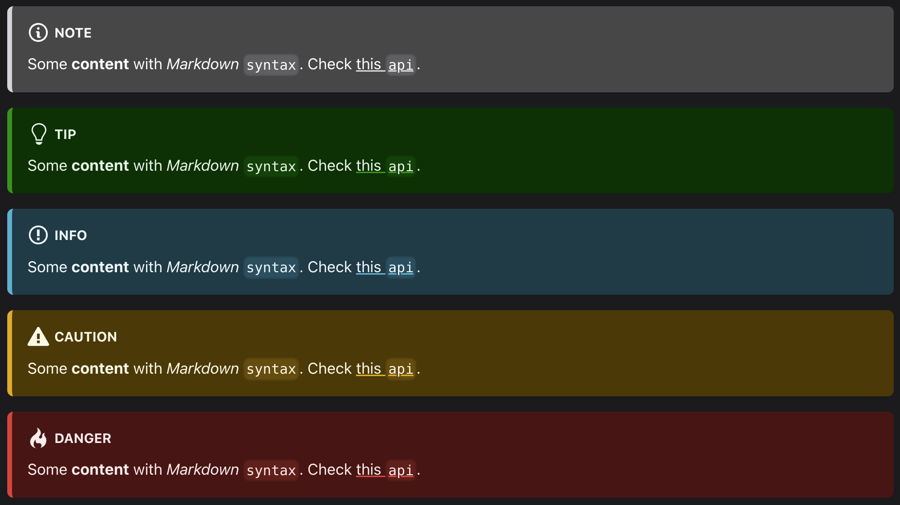
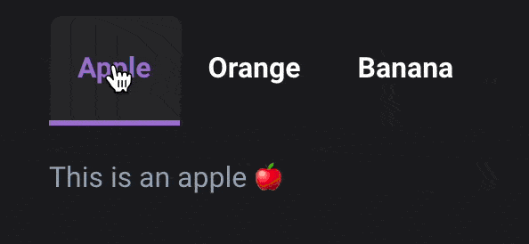

# Contributing to the kubefirst documentation

Firstly, we want to thank you for investing your valuable time to contribute to kubefirst!

Note we have a [code of conduct](CODE_OF_CONDUCT.md) which needs to be followed in all your interactions with the project to keep our community healthy.

_For contribution to the kubefirst CLI, please refer yourself to the [CONTRIBUTING.md](https://github.com/kubefirst/kubefirst/blob/main/CONTRIBUTING.md) from the [kubefirst repository](https://github.com/kubefirst/kubefirst)._

- [Ways to Contribute](#ways-to-contribute)
- [Getting Started](#getting-started)
  - [Commits](#commits)
  - [Images](#images)
  - [Markdown](#markdown)
  - [Search Index](#search-index)
  - [Testing](#testing)
  - [Update docs across versions](#update-docs-across-versions)
  - [Versioning](#versioning)
- [Help](#help)

## Ways to Contribute

At kubefirst, we believe that every contribution is valuable, not just the code one.

Whether you want to add more details to a specific section or a page, or that you want to fix a typo in the text or in a code example, you are more than welcome to can create a pull request.

For more substantial changes, it is highly suggested that you discuss your idea with us first. You can do that by either creating an [issue](https://github.com/kubefirst/kubefirst/issues/new?assignees=&labels=feature-request&template=feature_request.md&title=), or by joining us in our [Slack community](https://kubefirst.io/slack), and start a thread in the #contributors channel.

If you don't want to make the changes yourself, no worries, we got your back: just report the problem by creating an [issue](https://github.com/kubefirst/kubefirst/issues/new?assignees=&labels=feature-request&template=feature_request.md&title=) or letting us know on our [Slack Community](https://kubefirst.io/slack).

Please check if a problem or a suggestion has already been created as an [issue](https://github.com/kubefirst/docs/issues/) before creating a new one.

## Getting Started

We are using [Docusaurus](https://github.com/facebook/docusaurus) as our documentation platform. More information on Docusaurus is available in their [documentation](https://docusaurus.io/docs). Here's some guidelines that you need to follow or useful information you need to know about before doing any content modification.

### Commits

We subscribe to the [Conventional Commits specification](https://www.conventionalcommits.org). It can be a bit difficult to choose the right commit message prefix since this repository is for documentation, and not an application. Here are the guidelines for the documentation specific ones:

- `docs`: when adding new information to the docs (ex.: creating a new page, adding a section to an existing one).
- `fix`: when fixing the documentation (ex.: correcting a typo, rectifying untrue content).
- `refactor`: rewording part of the content or restructuring the documentation.

Here's the non content related ones:

- `chore`: anything that isn't Docusaurus code related (see `feat` prefix) or documentation content (ex.: updating the `CONTRIBUTING.md` file or releasing a new version of the docs).
- `ci`: any automation, probably GitHub Actions related.
- `feat`: anything related to Docusaurus as our documentation platform (ex.: updating Docusaurus, changing the configurations), aside from styling.
- `style`: anything about styling, mostly CSS.

As of now, we don't see usage for the `perf` & `test` prefixes.

### Images

All images will be automatically optimized with a lossless compression level to ensure the best possible experience, while minimizing the image size for slower or expensive internet connection.

#### Alt Text

All images must have alternative text (alt text) that are representative, and descriptive of the image. It is important as we want our documentation to be accessible to everyone. Images with complex or with a lot of information, such as diagrams, should have a short description in the alt text, and have a full-fledge text explaining every part either within the documentation or as an additional page. As for "utility images", the alt text should be a description of the information or action intended by the image, and not the image or icon itself (ex.: a Twitter logo icon that links to our Twitter page should have "kubefirst Twitter account" instead of "Twitter logo" alt text).

#### Themed images

If you want to use a different image for light, and dark mode, you can use the following syntax:

```markdown

```

The magic happens with the CSS looking for path fragments, in our case, a URL with either `#light-mode` or `#dark-mode` in it, and don't display the other image.

### Markdown

Before being able to merge your PR, the [GitHub Action responsible for checking the Markdown validity](https://github.com/kubefirst/docs/blob/main/.github/workflows/check-markdown.yml) needs to pass. If you want to test your changes locally before sending a PR, you can do it by using [act](https://github.com/nektos/act), and run `act -j markdown-check`. We follow the [rules](https://github.com/DavidAnson/markdownlint#rules--aliases) from the [markdownlint application](https://github.com/DavidAnson/markdownlint) with the exceptions of:

- [MD013](https://github.com/DavidAnson/markdownlint/blob/main/doc/md013.md): limiting the line length to 80 as it's easier to manage without line breaks within the text for documentation content.
- [MD024](https://github.com/DavidAnson/markdownlint/blob/main/doc/md024.md): preventing same text headers as it's needed for our project documentation.
- [MD033](https://github.com/DavidAnson/markdownlint/blob/main/doc/md033.md): restrict inline HTML as we sometimes need more customization for the content than what Markdown allows.

We also enforce some styling to prevent ambiguity, and ensure consistency for:

- MD049: underscores for italic text.
- MD050: asterisks for bold text.

### Markdown React

We are also using MDX files, which bring some advantages, and maintenance complications.

#### Advantages

We can now use React syntax to simplify repetition of sections: as one example, check [docs/civo/overview.mdx](./docs/civo/overview.mdx) where we use `<CommonProvisionProcess firstitem="Create a Kubernetes cluster in the Civo cloud."/>` in the file to display the common provision process which is nearly the same for each cloud. To be able to use this component, we imported the file with the line of code `import CommonProvisionProcess from "@site/docs/common/partials/common/_provision-process.mdx";'` at the top. You can also send pass objects, see them as variables, to customize the imported component. In this case, each provision process is the same except the first item, which is specific to the cloud selected.

It is important that partial filenames start with an underscore like `_provision-process.mdx`, so Docusaurus does not generate a separate documentation page for them.

#### Complications

The minimizing of content duplication is making the content easier to maintain, and at the same time, way more complicated with all the import statements, and non-basic Markdown code. It means managing a lot more files, and often editing more than one file for a specific section or a specific rendered page of the documentation.

##### MDX v1 vs v2 support

MDX v2 will be supported in Docusaurus v3, which is not available yet, so this brings other complications.

###### React Comments

HTML style comments `<!-- this is a comment -->` in MDX v1 were replaced by `{/* this is a comment */}` in MDX v2. Since GitHub is using syntax highlight from MDX v2, the latest display well in GitHub, but isn't supported yet in Docusaurus as its using MDX v1. It means that the HTML comments will be displayed as if the code was removed if you check the file diff in the GitHub web interface. Until Docusaurus v2 is released, the fix is simple: instead of commenting directly in the `.mdx`` files for issues or todos, please create GitHub issues for what need to be done. Even when Docusaurus will support MDX v2 like GitHub, it's best practice not to comment directly tasks or todos in the file, but to create GitHub issues anyway.

###### Component props variables

In MDX v1, JSX and Markdown don't interoperate well: it has been fixed in MDX v2. It means that if you pass a variable as you saw in the `CommonProvisionProcess` example shown above, if you use `{props.firstitem}` in the imported `.mdx` file, it will be treated as text. The fix is to enclose the variable between HTML tags so it's treated as JSX. It could be as sample as putting it between span `<span>{props.firstitem}</span>` like we did in [docs/common/partials/common/_provision-process.mdx](./docs/common/partials/common/_provision-process.mdx).

#### Special Syntax

##### Admonitions

You can also use special Docusaurus Markdown syntax called admonitions, which let you display beautiful notes, information, warnings, and others.

```markdown
:::note

Some **content** with _Markdown_ `syntax`. Check [this `api`](#).

:::

:::tip

Some **content** with _Markdown_ `syntax`. Check [this `api`](#).

:::

:::info

Some **content** with _Markdown_ `syntax`. Check [this `api`](#).

:::

:::caution

Some **content** with _Markdown_ `syntax`. Check [this `api`](#).

:::

:::danger

Some **content** with _Markdown_ `syntax`. Check [this `api`](#).

:::
```

which generate



##### Tabs

If you want to create tabs, it will possible, thanks to the [remark-docusaurus-tabs plugin](https://github.com/mccleanp/remark-docusaurus-tabs). You can do it by using the following syntax:

```markdown
<!--tabs-->
# Apple

This is an apple 🍎

# Orange

This is an orange 🍊

# Banana

This is a banana 🍌
<!--/tabs-->
```

It will generate the following:



In a nutshell, H1 inside the `<!--tabs--><!--/tabs-->` will be use as tab title, and everything in between as the tab content. It is useful when the documentation is similar to most platforms with small exceptions, like CLI commands.

#### Syntax Highlight

Docusaurus is using Prism for code block syntax highlighting. Here's a list of [supported languages](https://prismjs.com/#supported-languages).

### Search Index

We use [Typesense](https://github.com/typesense/typesense) as the search engine for our documentation. The index should be updated automatically when we deploy a new version using GitHub Actions, but it's not possible right now. The technology we use to serve the docs doesn't manage the trailing slashes, and 404 well, which makes the [Typesense DocSearch scraper](https://github.com/typesense/typesense-docsearch-scraper) loop infinitely on content. So until we have a proper documentation deployment in place, we have to update the search index manually. To do so, you will need [npm](https://github.com/npm/cli), and [Docker](https://www.docker.com) installed.

The first step is to build the documentation:

```shell
npm run build
```

After that, deploy the content of the `build` folder to a hosting service on it's own domain or subdomain. After that, open the [typesense.docsearch.config.json](https://github.com/kubefirst/docs/blob/main/typesense.docsearch.config.json) file. You need to replace the domain `docs.kubefirst.io` with your own inside the `start_urls`, and the `sitemap_urls` JSON properties. This is gonna work even if your domain isn't `docs.kubefirst.io` as the search index is built using the relative path of the indexed content.

As a final step, you need to create a `.env` file with the following content. Replace the `TYPESENSE_API_KEY` value with a kubefirst Typesense API key with writing access:

```dotenv
TYPESENSE_API_KEY=<API_KEY>
TYPESENSE_HOST=typesense.mgmt.kubefirst.com
TYPESENSE_PORT=443
TYPESENSE_PROTOCOL=https
```

You are now ready to run the scraper:

```shell
docker run -it --env-file=.env -e "CONFIG=$(cat typesense.docsearch.config.json | jq -r tostring)" \
  typesense/docsearch-scraper:0.5.0
```

If everything goes right, you'll see a bunch of output, and the process should end with the line `Nb hits: 935` (the number of hits will probably differ as we update the content).

### Testing

To run our documentation locally, simply run `npm start`.

> If you modify the CSS, the changes aren't picked up by the development server like when you modify the documentation content. You need to restart the server with npm.

### Update docs across versions

Sometimes changes in `v.next` are also valid for previous versions, which is often the case when refactoring a section, or adding missing information to a page. You can either copy the change content manually, or use the ZSH tools we created easily for that. First, you need to stage the file(s) you modified or created. Once it's done, run this command from the documentation folder in your terminal:

```shell
zsh tools/duplicator.zsh
```

You'll be presented with a menu giving you the opportunity to select the files you want to copy, and also the possibility to select to which version you want to do it. Once the selections are done, the script will copy or overwrite existing files with the one you modified, and will stage them. You only need to create a new branch for the PR, and [commit](#commits) the changes.

> Note that it is copying the entire file, so it will overwrite the content to the targeted version. We may support updating only changes content in the future.

### Versioning

Docusaurus manages [documentation versions](https://docusaurus.io/docs/versioning), which we started to use since the v2.0.0 release. It means that every time we release a new version (minor or major only) of kubefirst, we need to freeze the `next` documentation, meaning the documentation updated in the `docs` directory, into a versioned one inside the `versioned_docs\version-X.X` folder. For now, this process is manual, and can be done using the following commands (replace X.X by the new release version):

```shell
git checkout -b vX.X
npm run docusaurus docs:version X.X
git add versioned_docs/version-X.X
git add versions.json
git add versioned_sidebars/version-X.X-sidebars.json
git commit -m "docs: create vX.X documentation"
gh pr create
```

It will create a duplication of the `docs` folder inside the newly created `version-X.X` folder located into `versioned_docs`. From this point forward, the new changes need to be done in the `docs` folder, which is now the documentation for the next release.

> In the case of documentation modifications that are not only valuable for the next release (i.e.: typo in a sentence, clarification of a section, or missing information from a feature that precedes the latest release), you should apply the same changes in the `version-X.X` folder that you did in the `docs` one. Note that we decided to update only `next` and the latest docs release (last minor or major release) in that situation, even if it applies to multiple previous versions.

## Help

If you need help in your kubefirst journey as a contributor, please join our [Slack Community](http://kubefirst.io/slack). We have the `#contributors` channel where you can ask any questions or get help with anything contribution-related. For support as a user, please ask in the `#helping-hands` channel, or directly to @fharper (Fred in Slack), our Developer Advocate.
