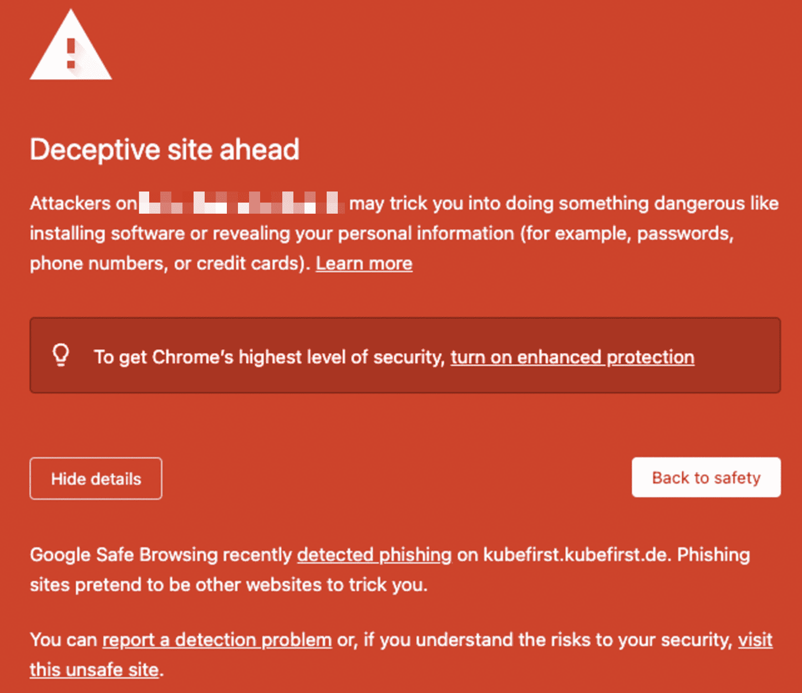

## General

### I ran into an issue, what should I do?

If an error occurs, try to run the command again: there is a `~/.kubefirst` file on your localhost that keeps track of your execution state. If it still doesn't work, check the log file which was created in the `~/.k1/logs` folder.

If you are not sure about the steps to take to fix the problem you encouter, join our [Slack community](https://kubefirst.io/slack), and ask for help in the `#helping-hands` channel. We'll gladly work through it with you.

If you think there is a bug, you can also open an [issue](https://github.com/kubefirst/kubefirst/issues) describing the problems you are having.

### How do I tear my cluster down?

You can easily take your cluster down, by using the [destroy command](explore/destroy.md).

### I'm experiencing timeouts when kubefirst deploys Argo CD or HashiCorp Vault through the Helm installations

You may need a more stable connection / higher download speed. Check with your internet provider or use an online speed test to confirm you have at least 100mbps download speed, or else you may experience timeouts.

### Where can I find the services passwords?

Run the command `kubefirst <platform> root-credentials` where `<platform>` is one of `k3d`, `aws`, `civo`

### I'm stuck with artifacts after a failed local installation and can't continue

If you still cannot complete the installation due to remaining artifacts after completing a `kubefirst k3d destroy`, you may have to do a manual teardown. Firsly, you need to delete the k3d cluster with the following command:

```shell
$HOME/.k1/tools/k3d cluster delete kubefirst
kubefirst reset
```

Once it's done, you can delete the GitHub assets we created by logging into your account and removing the `gitops`, and `metaphor` repositories. You can also use the GitHub CLI to do that1:

```shell
gh repo delete <GITHUB_USERNAME>/metaphor --confirm
gh repo delete <GITHUB_USERNAME>/gitops --confirm
```

## Civo

### Dummy website served at your domain root

<!-- Add screenshot of website served -->

With Civo, Google Search Crawlers are flagging domains as deceptive when they have no apex records. It is a problem happening only with Civo: you won't have this issue with AWS or local (k3d) deployment. To fix the issue, we added an apex record, and created a pod with a Nginx server at the domain root, delivering a dummy website.

If you want to replace the dummy website with yours or serve an application instead, it should still prevent the problem from happening. If removed, you may see the following error when accessing your domain (or any of its subdomains) in the browser.



## Local (k3d)

### Cannot connect to the Docker daemon

```shell
Error: Cannot connect to the Docker daemon at unix:///var/run/docker.sock. Is the docker daemon running?
```

If Docker is running, and working properly (run `docker run hello-world` in your terminal to test it), but you get the error above while trying to create a cluster with k3d, it may be related to [this Docker issue](https://github.com/docker/for-mac/issues/6529). It was fixed a while ago, but it seems like the problem is back. Since it's a Docker issue, and that the Unix sockets default path should be `/var/run/docker.sock`, you can create the symlink yourself by using the following command:

```shell
sudo ln -s "$HOME/.docker/run/docker.sock" /var/run/docker.sock
```
