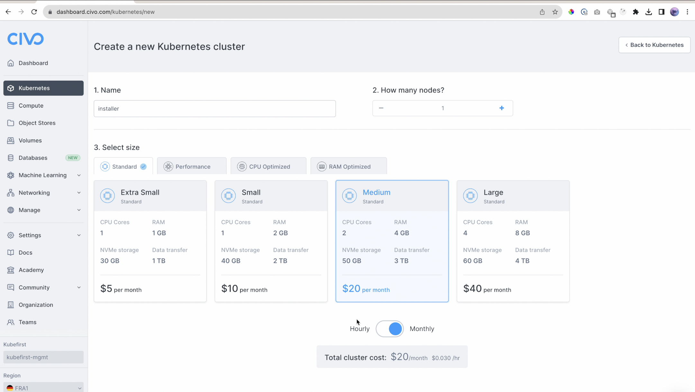
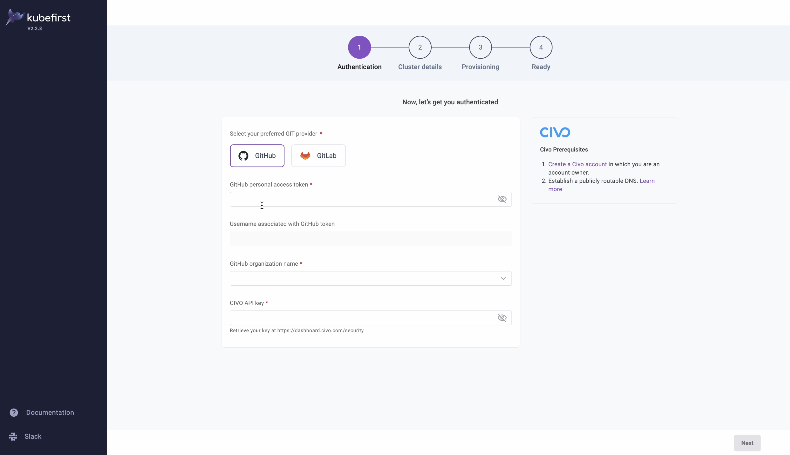

# Install kubefirst using the Civo Marketplace

You can create a temporary kubefirst installer cluster through the Civo Kubernetes marketplace, and use it to create your kubefirst management cluster.

## Create your installer cluster

Log into your Civo account and navigate to [Kubernetes](https://dashboard.civo.com/kubernetes).

1. Click "Create New Cluster"
2. Name the cluster `installer`
3. Reduce the node count to `1`
4. Increase the node size to `Medium`
5. In the Marketplace section select `kubefirst`
6. Click Create Cluster and wait until the cluster is ready



## Connect to the install cluster and the kubefirst installer service

In your terminal, run the following commands to download and use your new cluster's kubeconfig. This example assumes you named your cluster `installer`.

```bash
civo kubernetes config installer --save
kubectl --namespace kubefirst port-forward svc/kubefirst-console 8080:8080
```

Then launch the installer in your browser:

[http://localhost:8080/](http://localhost:8080/)

## Create your kubefirst management cluster

Provide details about your preferred Git provider, access, and cluster details and let kubefirst do the rest.



## Deleting your installer cluster

Once you've successfully installed your kubefirst `management` cluster, you can delete the `installer` cluster directly in the Civo UI. It is only used to establish the platform.
