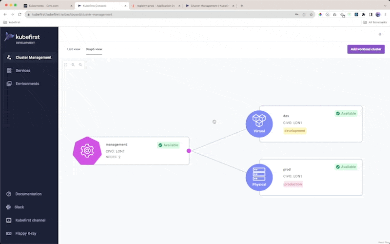
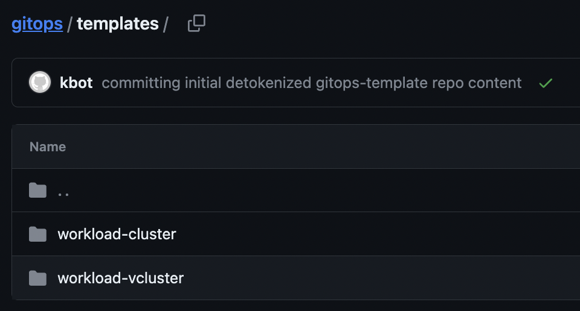
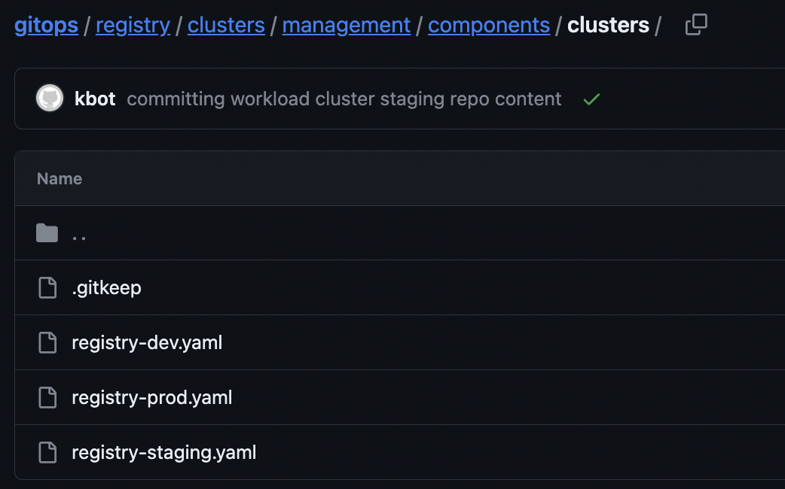
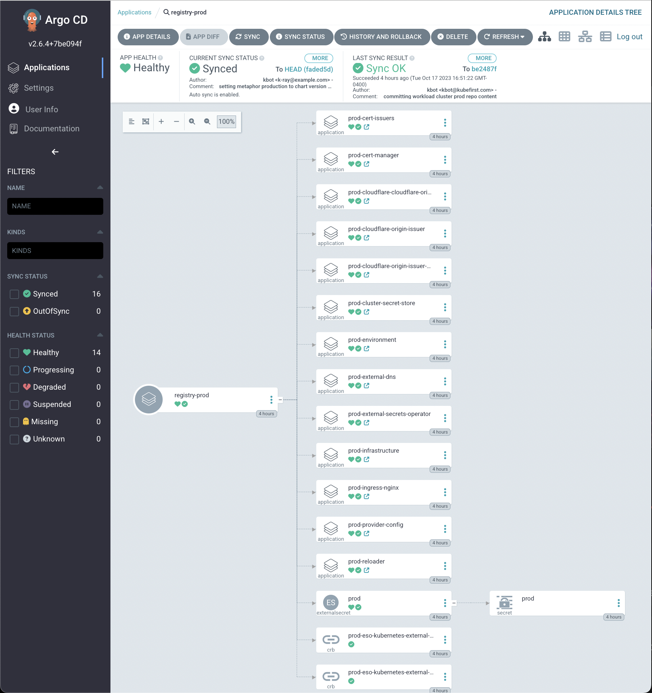

The kubefirst 2.3 release introduces kubernetes cluster lifecycle management to the platform to provide our users with the ability
to create their own opinionated workload clusters in a way that takes advantage of their management cluster. We're introducing both
physical clusters, which will be created in your cloud account, as well as virtual clusters, which are also isolated kubernetes
clusters, but which run inside your management cluster.

## GitOps-Oriented Workload Clusters

By default, a new kubefirst will provide you with 2 template-driven directories that will drive how your workload clusters are created.

Each cluster that you create from these templates through our management interface will orchestrate the following:

- new Argo CD project in the management cluster's Argo CD instance to encapsulate the apps that are delivered to that new cluster
- a new app-of-apps for your cluster will be added to your `registry/clusters` directory in your `gitops` repo and bound to your manangement cluster's orchestration in `registry/clusters/<management-cluster>/components/clusters`
- an optional environment binding so a new cluster can establish a space for a new environment in your gitops repository

## Cluster Provisioning Orchestration

If you inspect your templates for cluster and vcluster, you'll find them to be very similar. They will both create new kubernetes clusters with the following components preloaded:

- infrastructure (virtual): vcluster kubernetes cluster that will run in a namespace in your management cluster, with an additional bootstrap app to configure the cluster with crossplane-managed terraform
- infrastructure (physical): crossplane-managed terraform that creates a kubernetes cluster tailored to your cloud and configures the cluster
- ingress-nginx ingress controller
- external-dns preconfigured for your domain
- external-secrets-operator with preconfigured secret store to access vault in the management cluster
- cert-manager with clusterissuers preconfigured
- reloader for pod restart automation
- optional binding to an environment directory in your gitops repo
- you can customize this template in your gitops repository as your needs require

:::tip
The Kubefirst Console "Physical Clusters" feature will be the first feature of our upcoming Pro tier. We'd love for you to try it out and tell us what you think during its free introductory period.

We plan to keep the Kubefirst Console "Virtual Clusters" feature on the Community tier at no cost.

You will always be able to create anything you need on your own without our user interface, and we hope you find that starting point immensly valuable. We hope to earn your business with our management interface. Thank you sincerely to all of our customers.
:::

## Operating your workload clusters

When you create a cluster in our UI we place the gitops content for the cluster and its apps in your gitops repository. You'll be able to see it in your gitops repo commits.

Cluster creation takes about 6 minutes to fully sync in Argo CD for virtual clusters. Physical clusters take anywhere from 5 to 25 minutes to fully sync, depending on the cloud, the weather, or anything in between.

Your workload cluster will have a starting point app-of-apps in Argo CD in the `clusters` app and will share your cluster's name.

When you delete a cluster, kubefirst will remove the binding from your management cluster so that it begins deleting in Argo CD, but we must leave the directory there so that the apps can remove gracefully. You're free to remove it once cluster deprovisioning has completed successfully. Deletion takes time to deprovision resources - can be anywhere from 5 to 15 minites depending on the cloud. Be patient and inspect the deprovision operation in argocd.
