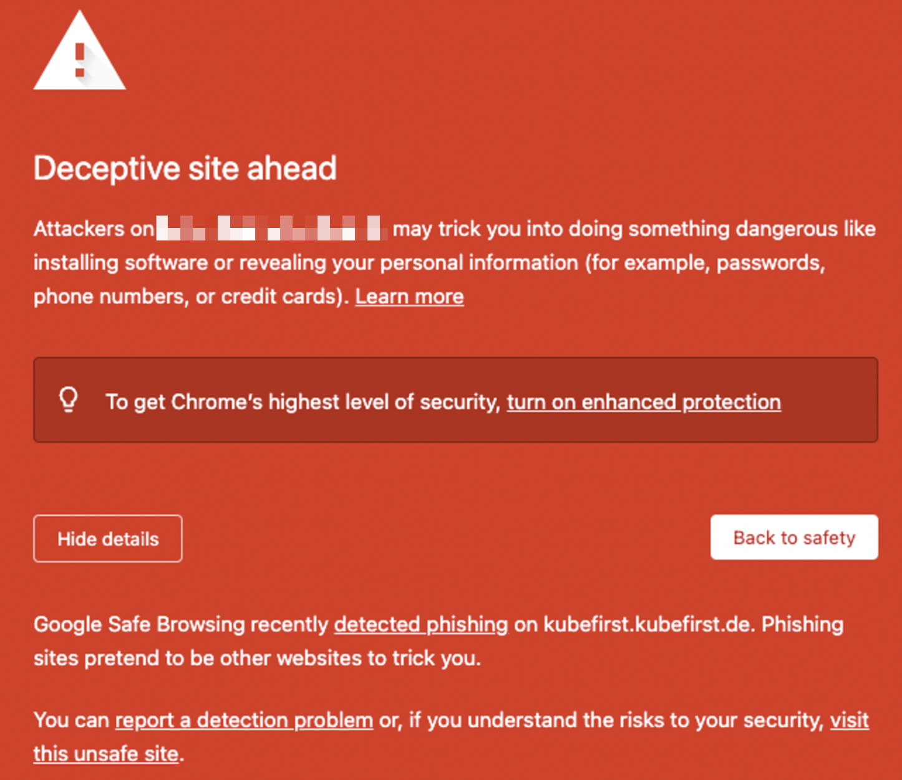

## General

### I ran into an issue, what should I do?

If an error occurs, try to run the command again: there is a `~/.kubefirst` file on your localhost that keeps track of your execution state. If it still doesn't work, check the log file which was created in the `~/.k1/logs` folder.

If you are not sure about the steps to take to fix the problem you encounter, join our [Slack community](https://kubefirst.io/slack), and ask for help in the `#helping-hands` channel. We'll gladly work through it with you.

If you think there is a bug, you can also open an [issue](https://github.com/kubefirst/kubefirst/issues) describing the problems you are having.

### How do I tear my cluster down?

You can easily take your cluster down, by using the [destroy command](./deprovision.mdx).

### I'm experiencing timeouts when kubefirst deploys Argo CD or HashiCorp Vault through the Helm installations

You may need a more stable connection / higher download speed. Check with your internet provider or use an online speed test to confirm you have at least 100mbps download speed, or else you may experience timeouts.

### Where can I find the services passwords?

Run the command `kubefirst <platform> root-credentials` where `<platform>` is one of `k3d`, `aws`, `civo`

### I'm stuck with artifacts after a failed local installation and can't continue

If you still cannot complete the installation due to remaining artifacts after completing a `kubefirst k3d destroy`, you may have to do a manual teardown. Firstly, you need to delete the k3d cluster with the following command:

```shell
$HOME/.k1/tools/k3d cluster delete kubefirst
kubefirst reset
```

Once it's done, you can delete the GitHub assets we created by logging into your account and removing the `gitops`, and `metaphor` repositories. You can also use the GitHub CLI to do that1:

```shell
gh repo delete <GITHUB_USERNAME>/metaphor --confirm
gh repo delete <GITHUB_USERNAME>/gitops --confirm
```

## Civo

### Dummy website served at your domain root

With Civo, Google Search Crawlers are flagging domains as deceptive when they have no apex records. It is a problem happening only with Civo: you won't have this issue with AWS or local (k3d) deployment. To fix the issue, we added an apex record, and created a pod with a NGINX server at the domain root, delivering a dummy website.

If you want to replace the dummy website with yours or serve an application instead, it should still prevent the problem from happening. If removed, you may see the following error when accessing your domain (or any of its subdomains) in the browser.



## Local (k3d)

### Cannot connect to the Docker daemon

```shell
Error: Cannot connect to the Docker daemon at unix:///var/run/docker.sock. Is the docker daemon running?
```

If Docker is running, and working properly (run `docker run hello-world` in your terminal to test it), but you get the error above while trying to create a cluster with k3d, it may be related to [this Docker issue](https://github.com/docker/for-mac/issues/6529). It was fixed a while ago, but it seems like the problem is back. Since it's a Docker issue, and that the Unix sockets default path should be `/var/run/docker.sock`, you can specify the path using the `DOCKER_HOST` variable:

```shell
export DOCKER_HOST="unix://$HOME/.docker/run/docker.sock"
```

### Using Rancher Desktop Instead of Docker Desktop

Firstly, you need to disable Traefik in your Rancher Desktop because our installation uses Traefik and port forwarding. Between the conflicts and the double routing, it's just easier to disable Traefik on Rancher Desktop.

#### macOS (Apple Silicon)

> This is experimental. It works, but all of the features it uses are considered beta or experimental by Rancher Desktop.

For Apple Silicon macOS, you need to enable a few features in Rancher Desktop before this works. Run the following command in your terminal:

```shell
rdctl set --container-engine.name docker \
    --kubernetes.options.traefik=false \
    --experimental.virtual-machine.type vz \
    --experimental.virtual-machine.use-rosetta=true \
    --experimental.virtual-machine.mount.type virtiofs \
    --experimental.virtual-machine.socket-vmnet=true
```

If you have any issues, reach out to us on our [Slack community](https://kubefirst.io/slack).

#### macOS (Intel)

Not yet tested.

#### Windows Subsystem for Linux (WSL) on Windows

Rancher Desktop is not yet supported but Docker Desktop is with [WSL on Windows](https://learn.microsoft.com/en-us/windows/wsl/install). There are limitations within Rancher Desktop and how it manages volumes which prevent us from supporting it at this moment.

### Using nerdctl Instead of Docker

Creation via [nerdctl](https://github.com/containerd/nerdctl) isn't supported yet. k3d doesn't fully support it probably because it doesn't have an API that is publicly exposed like the Docker daemon. We need k3d to support nerdctl and containerd on WSL before we can add support in kubefirst.

### Using Lima Instead of Docker Desktop

We didn't try kubefirst k3d cluster creation with [Lima](https://github.com/lima-vm/lima) yet. If you are using it, let us know how it's working, and if you think it's something we can support with the existing codebase.
