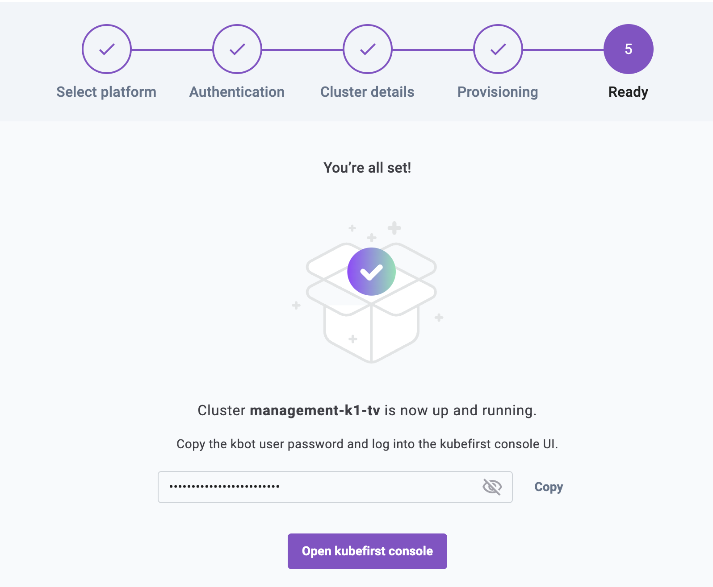
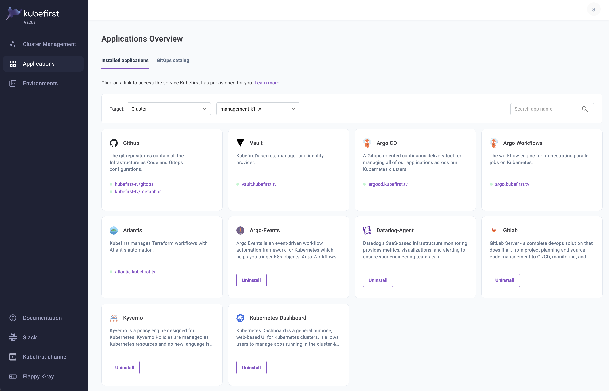

# GitOps Catalog

After your kubefirst cluster has been provisioned, you can optionally leverage the Kubefirst GitOps Catalog.

The GitOps Catalog is a curated collection of Kubernetes applications that can be deployed directly to your kubefirst cluster(s).

For more information regarding applications that are generally available, check out the GitOps Catalog [repository](https://github.com/kubefirst/gitops-catalog).

## Using the catalog

After your cluster has been provisioned, you're able to click on a button to **open kubefirst console**:



Once this button has been clicked, you're presented with the **Services Overview** page:



This page shows the services that have been provisioned to your kubefirst management cluster. Default applications will show up in this list as well.

You can click on the **GitOps catalog** button to show the catalog:


From here, you can click **Install** on any of the available services to deploy them to your cluster.

## How this works

When you opt to install any of the available services from the GitOps Catalog, the kubefirst API formats and commits a set of files to your gitops repository.

Then, Argo CD is asked to refresh the upstream registry to synchronize the newly deployed application.

Since the deployment of these applications is done directly in your gitops repository, you have full ownership to then customize these applications by adjusting their content within your gitops repository.

For example - consider the following sample deployment of Kuberntes Dashboard:

```yaml
---
apiVersion: argoproj.io/v1alpha1
kind: Application
metadata:
  name: kubernetes-dashboard
  namespace: argocd
spec:
  project: default
  source:
    repoURL: 'https://kubernetes.github.io/dashboard'
    targetRevision: 6.0.0
    chart: kubernetes-dashboard
  destination:
    server: 'https://kubernetes.default.svc'
    namespace: kubernetes-dashboard
  syncPolicy:
    automated:
      prune: true
      selfHeal: true
    syncOptions:
      - CreateNamespace=true

---
kind: ClusterRoleBinding
apiVersion: rbac.authorization.k8s.io/v1
metadata:
  name: k8s-dashboard-clusterrole
  annotations:
    argocd.argoproj.io/sync-wave: '0'
subjects:
  - kind: ServiceAccount
    name: k8s-dashboard-sa
    namespace: default
roleRef:
  kind: ClusterRole
  name: admin
  apiGroup: rbac.authorization.k8s.io
---
apiVersion: v1
kind: ServiceAccount
metadata:
  name: k8s-dashboard-sa
  namespace: default
```

If you'd like to change any of the helm chart values, change the helm chart version, or add any additional resources, you simply edit this file and Argo CD will detect the changes from your upstream gitops repository and synchronize.
