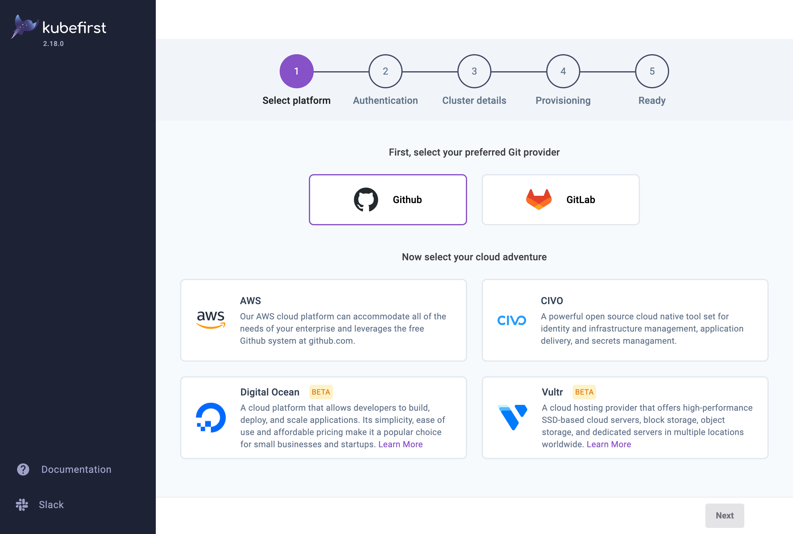

There are a few ways to install kubefirst, whether you have a cluster already or don't.

<!-- TODO: 2.1 - update chart version, arm/amd, atlas, etc -->

# Install Kubefirst

## Step 1: Install kubefirst console

<!--tabs-->

# Helm

This will install our platform installer tools to your existing cluster so you can 
create your new management cluster in your favorite cloud provider using your 
favorite git provider.

```
helm repo add kubefirst https://charts.kubefirst.com
helm repo update

helm install kubefirst --create-namespace --namespace kubefirst kubefirst/kubefirst

kubectl port-forward svc/kubefirst-console 8080:8080
```

Then connect to the provisioning tool at [http://localhost:8080](http://localhost:8080)

# Helm (ARM / M1 Mac / M2 Mac)

This will install our platform installer UI to your existing cluster so you can 
create your new management cluster in your favorite cloud provider using your 
favorite git provider.

This example shows a couple additional helm values settings that enable mongo to
run on the ARM architecture.

```
helm repo add kubefirst https://charts.kubefirst.com
helm repo update

helm install kubefirst --create-namespace --namespace kubefirst \
--set=mongodb.image.repository=arm64v8/mongo \
--set=mongodb.image.tag=latest \
--set=mongodb.persistence.mountPath=/data/db \
--set=mongodb.extraEnvVarsSecret=kubefirst-initial-secrets \
kubefirst/kubefirst

kubectl port-forward svc/kubefirst-console 8080:8080
```

Then connect to the provisioning tool at [http://localhost:8080](http://localhost:8080)

# No kubernetes yet?

**No cluster? No problem!** Let us create your bootstrap cluster for you as well. We'll install our provisioning tool into it to create your permanent infrastructure.

```
brew install kubefirst/tools/kubefirst

kubefirst launch up
```

Then connect to the provisioning tool at 
[https://console.kubefirst.dev](https://console.kubefirst.dev )

:::note

The kubefirst.dev domain is only available after `kubefirst launch up` and resolves to the host machine.

:::

# CLI GitHub

```shell
export GITHUB_TOKEN=ghp_xxxxxxxxxxxxxxx

kubefirst aws create \
  --alerts-email yourdistro@your-company.io \
  --domain-name your-company.io \
  --cluster-name kubefirst-mgmt \
  --github-org your-github-organization-name
```

# CLI GitLab

```shell
export GITLAB_TOKEN=glpat-xxxxxxxxxxxxxxx

kubefirst aws create \
  --alerts-email yourdistro@your-company.io \
  --git-provider gitlab \
  --gitlab-group your-gitlab-group \
  --domain-name your-domain.io \
  --cluster-name kubefirst
```

<!--/tabs-->

## Step 2: Install your kubefirst management cluster

:::note: if you installed via CLI GitHub/GitLab you can skip this step
:::

Provide details about your preferred git provider, cloud provider, access, and cluster details and let kubefirst do the rest.

