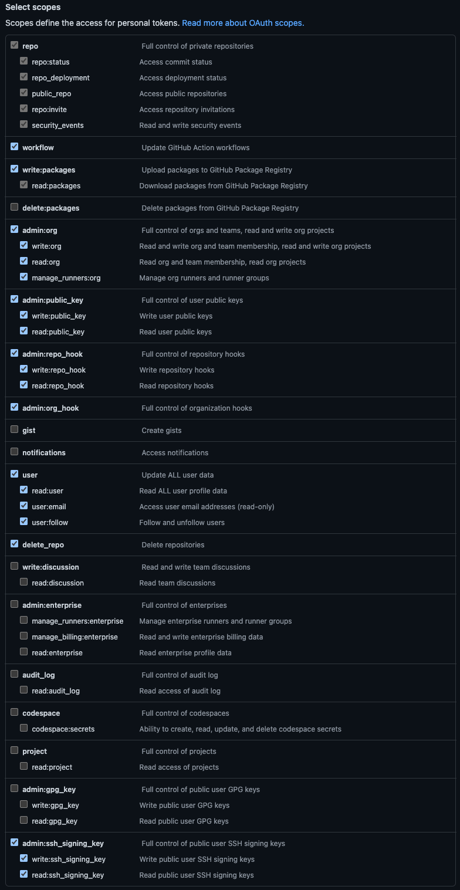

Kubefirst needs a GitHub token to authenticate with the GitHub API. The token is used to perform various actions on a user's behalf like the cluster creation, but also by Atlantis and Argo CD during your management, and workload clusters usage.

## How to create a GitHub Token

The easiest way is to start the Kubefirst installer, and follow the screen instructions. It will guide you to issue a token with the list of scope described above to issue a GitHub Token using the [GitHub device login flow](https://docs.github.com/en/apps/oauth-apps/building-oauth-apps/authorizing-oauth-apps#device-flow).

You can also log in to your GitHub account and issue a Personal Access token following the [list of scopes below](#github-token-scopes). With the manually generated token, you can provide it via environment variable using `export GITHUB_TOKEN=ghp_xxxxxxxxxxxxxxxx`.

:::tip
If you never connected to GitHub using SSH before and are creating a cluster using the CLI, be sure to add it to the known host using the command `ssh-keyscan github.com >> ~/.ssh/known_hosts` to ensure you won't get a `ssh: handshake failed: knownhosts: key is unknown` error. If you get the `known_hosts file does not exist` error when running the previous command, it's because you are missing the `~/.ssh` folder, so run `mkdir ~/.ssh` and try the `ssh-keyscan` command again.
:::

### GitHub Token Scopes

Kubefirst needs the following scopes or scopes groups:

<!-- vale off -->
| Scope                 | Score Permission                             | Kubefirst Usage                                                                                         |
|-----------------------|----------------------------------------------|---------------------------------------------------------------------------------------------------------|
| repo                  | Full access to public & private repositories | Creating 2 repositories on cluster creation & manage repositories related to your cluster with Atlantis |
| workflow              | Add & update GitHub Actions workflow files   | Creating workflows that will help manage your cluster and repositories                                  |
| write:packages        | Upload & publish packages in GitHub Packages | Creating application packages (ex.: metaphor)                                                           |
| admin:org             | Fully manage the organization                | Managing users and accesses with Infrastructure as Code using Atlantis & Vault                          |
| admin:public_key      | Fully manage public keys                     | Needed for the Kubefirst admin kbot user to take action in the repositories we created for you          |
| admin:repo_hook       | Full access to repository hooks              | Creating hooks for Atlantis to subscribe to some GitHub events (i.e., comments, pull requests...)       |
| admin:org_hook        | Full access to organization hooks            | This is will be removed soon (see [#2180](https://github.com/kubefirst/kubefirst/issues/2180))          |
| user                  | Grants read & write access to profile info   | Retrieving the user profile to display in the console UI & let the user validate the used token         |
| delete_repo           | Delete repositories                          | Deleting repositories managed by Infrastructure as Code with Atlantis                                   |
| admin:ssh_signing_key | Full control of public user SSH signing keys | This is will be removed soon (see [#2180](https://github.com/kubefirst/kubefirst/issues/2180))          |
<!-- vale on -->

You can read more about the [scopes in the GitHub documentation](https://docs.github.com/en/apps/oauth-apps/building-oauth-apps/scopes-for-oauth-apps#available-scopes).

:::warning
Those permissions are the minimum requirement for Kubefirst to function properly.

If you feel unease with that, we suggest you create a new GitHub user or organization for the sake of testing Kubefirst.
:::
