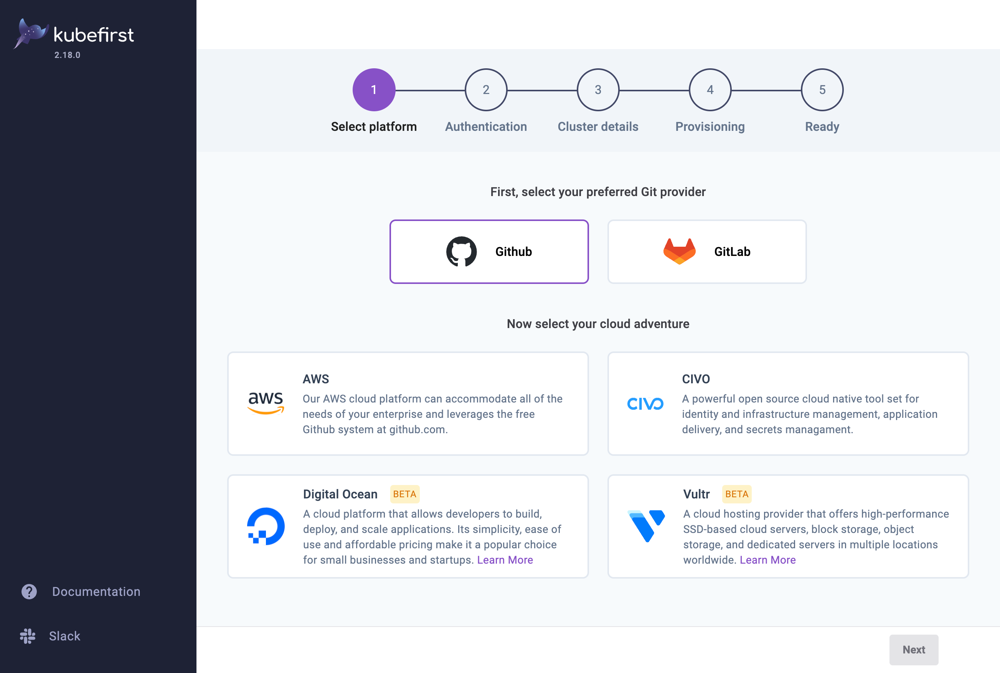

import Tabs from "@theme/Tabs";
import TabItem from "@theme/TabItem";

import Homebrew from '../common/partials/common/_ui-homebrew.mdx'
import Helm from '../common/partials/common/_ui-helm.mdx'
import HelmArm from '../common/partials/common/_ui-helm-arm.mdx'

# Install kubefirst using the UI

There are a few ways to install kubefirst, whether you have a cluster already or don't.

## Step 1: Install kubefirst console

<Tabs>
    <TabItem value="homebrew" label="New cluster">
      <Homebrew />
    </TabItem>
    <TabItem value="helm" label="Helm">
      <Helm />
    </TabItem>
    <TabItem value="helm-arm" label="Helm (ARM / M1 Mac / M2 Mac)">
      <HelmArm />
    </TabItem>
</Tabs>

## Step 2: Install your kubefirst management cluster

Provide details about your preferred git provider, cloud provider, access, and cluster details and let kubefirst do the rest.

Once your management cluster is installed, you can safely destroy the Console UI by running `kubefirst launch down`.
