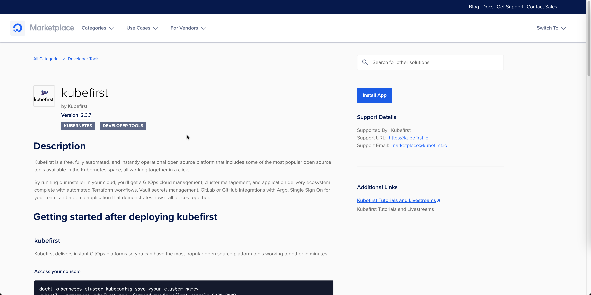
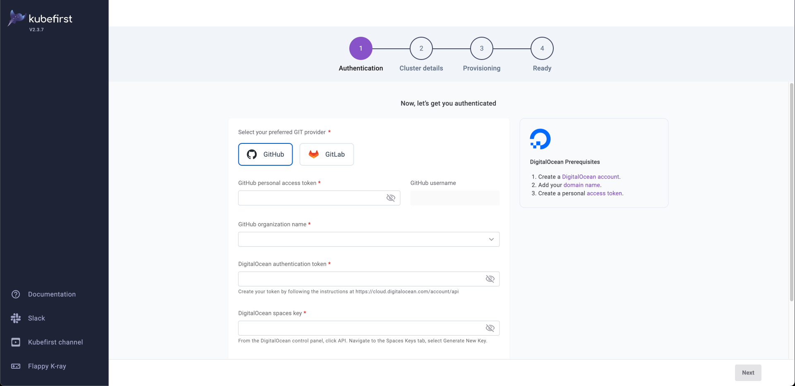

# Install kubefirst using the DigitalOcean Marketplace

You can create a temporary kubefirst installer cluster through the DigitalOcean Marketplace, and use it to create your kubefirst management cluster.

## Create your installer cluster



Log into your DigitalOcean account and navigate to the [kubefirst Marketplace page](https://marketplace.digitalocean.com/apps/kubefirst).

1. Click "Install App", it will open a new tab.
2. On the new tab, click "Install".
3. Choose the data center region. It doesn't matter much as this cluster will be use to install kubefirst.
4. Lower the nodes plan to `2 GB RAM / 1 vCPU / 50 GB Disk`
5. Reduce the nodes count to `2`
6. Name the cluster `installer`
7. Click "Create Cluster" and wait until the cluster is ready

## Connect to the install cluster and the kubefirst installer service

In your terminal, run the following commands to download and use your new cluster's kubeconfig. This example assumes you named your cluster `installer`.

```bash
doctl kubernetes cluster kubeconfig save installer
kubectl --namespace kubefirst port-forward svc/kubefirst-console 8080:8080
```

Then launch the installer in your browser:

[http://localhost:8080/](http://localhost:8080/)

## Create your kubefirst management cluster

Provide details about your preferred Git provider, access, and cluster details and let kubefirst do the rest.



## Deleting your installer cluster

Once you've successfully installed your kubefirst `management` cluster, you can delete the `installer` cluster directly in the DigitalOcean UI. It is only used to establish the platform.
