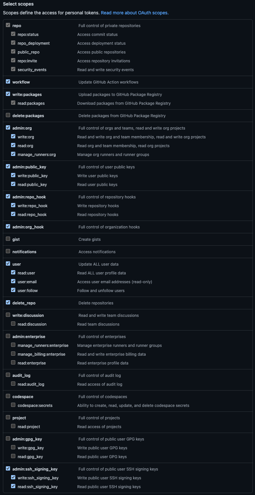

Kubefirst uses a GitHub token to authenticate with the GitHub API. Tokens can be used to perform various actions on a user's behalf, such as creating, and deleting repository files. Kubefirst uses a limited number of scopes (what is allowed with the issued token) to provision the Kubefirst platform such as creating GitHub repositories and updating GitHub repository webhook URL.

Kubefirst issue GitHub Tokens at the beginning of the installation using [GitHub device login flow](https://docs.github.com/en/apps/oauth-apps/building-oauth-apps/authorizing-oauth-apps#device-flow).

## GitHub Token Scopes

Kubefirst uses the following scopes to provision the Kubefirst platform:

## How to create a GitHub Token

There are different ways to create a GitHub token. The easiest way is to start the Kubefirst installer, and follow the screen instructions. It will guide you to issue a token with the list of scope described above.

There are other ways to create a GitHub token. You can login into your GitHub account and issue a Personal Access token following the list of scopes above. With the manually generated token, you can provide it via environment variable: `export KUBEFIRST_GITHUB_AUTH_TOKEN`.
