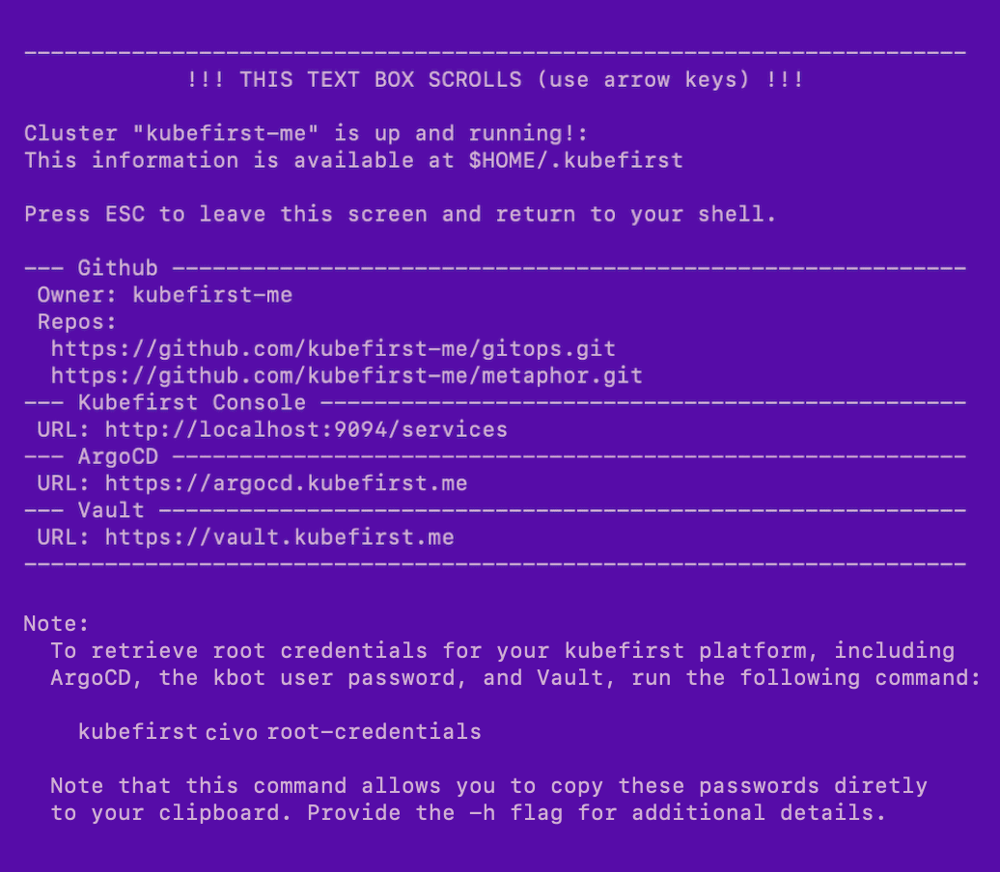

# Google Cloud Platform Installation

kubefirst generates your cloud native platform from a `helm install` or a `kubefirst` CLI execution.

## Prerequisites

### GitHub Prerequisites

- A GitHub [organisation](https://docs.github.com/en/organizations/collaborating-with-groups-in-organizations/creating-a-new-organization-from-scratch).
- A new GitHub [account](https://docs.github.com/en/get-started/signing-up-for-github/signing-up-for-a-new-github-account) for your `kbot` automation user.
- A GitHub [personal access token](../../../common/git-auth.mdx) for your `kbot` account.

### Google Cloud Prerequisites

For kubefirst to be able to provision your Google Cloud resources:

- A [Google Cloud account](https://cloud.google.com) in which you are an account owner.
- A publicly routable [DNS](https://cloud.google.com/dns/docs/overview).
- Generate [Application Default Credentials](https://cloud.google.com/docs/authentication/application-default-credentials#GAC) (ADC) (you could use the [Google Cloud CLI](https://cloud.google.com/sdk/gcloud) with the command `gcloud auth application-default login`)

## Create your new kubefirst cluster

Adjust the following command with your GitHub and Google Cloud credentials file path (it's set to the default for macOS in the code example below) in addition to the appropriate values for your new platform.

```shell
export GITHUB_TOKEN=ghp_xxxxxxxxxxxxxxxx
export GOOGLE_APPLICATION_CREDENTIALS=$HOME/.config/gcloud/application_default_credentials.json

kubefirst beta gcp create \
  --alerts-email yourdistro@your-company.io \
  --github-org your-github-org \
  --domain-name your-domain.io \
  --cluster-name kubefirst
```

The kubefirst CLI will produce a directory of utilities, a state file, and some staged platform content that can now be found in the `~/.kubefirst` and `~/.k1` folders on your local machine.

After the ~10 minute installation, your browser will launch a new tab to the [kubefirst Console](https://github.com/kubefirst/console), which will help you navigate your new suite of tools running in your new Google Cloud cluster.

If your deployment is not successful, errors and troubleshooting information will be stored in a local log file specified during the installation run.

## Console UI Screen


## Example of terminal output following cluster creation



## Root credentials

To obtain your 3 initial passwords, run

```bash
kubefirst beta gcp root-credentials
```


## Connecting to Kubernetes

To connect to your new Kubernetes cluster, run

```bash
export KUBECONFIG=~/.k1/kubeconfig
```

To view all cluster pods, run

```bash
kubectl get pods -A
```

### Installed Applications

To see what is installed by kubefirst, check the [overview page](../../overview.mdx).
