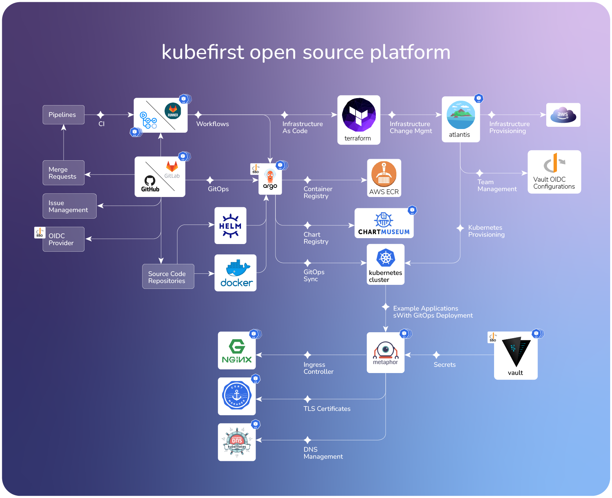

# kubefirst Platforms

## What is kubefirst?

kubefirst is a fully automated and operational open source platform that includes some of the most popular open source tools available in the Kubernetes space, all working together from a single command.

We support local, AWS, and Civo clouds. By running our cli commands against your empty environment, you'll get a GitOps cloud management and application delivery ecosystem complete with automated Terraform workflows, Vault secrets management, GitLab or GitHub integrations with Argo, and demo applications that demonstrate how it all pieces together.

---

## Choose your platform type

Choose one of the available options below

<!-- TODO: 2.0 - we need new images for gitlab k3d, github k3d, gitlab civo -->
<!-- TODO: 2.0 - consider reframing this section with 1 card per cloud and a github / gitlab button so we're not duplicating the message -->
<!-- TODO: 2.0 - note from jd: i don't understand where img\local_github.jpg is coming from - it's working but it doesn't seem to be in source in this repo somehow -->

    

        

            

            
            

            

            <h3>kubefirst Local (k3d with GitHub)</h3>
            

               The <strong>fastest</strong> way to explore the kubefirst platform!
            

            

               With kubefirst k3d, you can explore some of the best parts of the kubefirst platform running for free on a local k3d cluster in less than 5 minutes - without any cloud costs or domain prerequisites.
            

            

            

                <form>
                    <button class="button button--secondary button--block" formaction="kubefirst/local/github/install">View install instructions</button>
                </form>
            

        

    

    

        

            

            
            

            

            <h3>🆕 kubefirst Local (k3d with GitLab)</h3>
            

               The <strong>fastest</strong> way to explore the kubefirst platform!
            

            

               With kubefirst k3d, you can explore some of the best parts of the kubefirst platform running for free on a local k3d cluster in less than 5 minutes - without any cloud costs or domain prerequisites.
            

            

            

                <form>
                    <button class="button button--secondary button--block" formaction="kubefirst/local/gitlab/install">View install instructions</button>
                </form>
            

        

    

    

        

            

            
            

            

            <h3>🆕 kubefirst on CIVO Cloud (GitHub)</h3>
            

               The perfect cloud environment when Kubernetes will be the center of attention.
            

            
A <strong>simple cloud footprint</strong> with a powerful open source cloud native tool set for identity and infrastructure management, application delivery, and secrets management. Cloud native infrastructure with incredibly fast provisioning times.
            

            

            

                <form>
                    <button class="button button--secondary button--block" formaction="kubefirst/civo/github/install">View install instructions</button>
                </form>
            

        

    

    

        

            

            
            

            

            <h3>🆕 Kubefirst on CIVO Cloud (GitLab)</h3>
            

               The perfect cloud environment when Kubernetes will be the center of attention.
            

            
A <strong>simple cloud footprint</strong> with a powerful open source cloud native tool set for identity and infrastructure management, application delivery, and secrets management. Cloud native infrastructure with incredibly fast provisioning times.
            

            

            

                <form>
                    <button class="button button--secondary button--block" formaction="kubefirst/civo/gitlab/install">View install instructions</button>
                </form>
            

        

    

    

        

            

            
            

            

            <h3> kubefirst on AWS (GitHub)</h3>
            

               Our AWS cloud platform can accommodate all the <strong>needs of your enterprise</strong> and supports the <strong>GitHub</strong> git provider. All you need is a domain in addition to a hosted zone, and within 35 minutes of running a single command, you'll have a secure EKS infrastructure management and application delivery platform.
            

            

            

                <form>
                    <button class="button button--secondary button--block" formaction="kubefirst/aws/github/install">View install instructions</button>
                </form>
            

        

    

    

        

            

            
            

            

            <h3> kubefirst on AWS (GitLab)</h3>
            

               Our AWS cloud platform can accommodate all the <strong>needs of your enterprise</strong> and supports the <strong>GitLab</strong> git provider. All you need is a domain in addition to a hosted zone, and within 35 minutes of running a single command, you'll have a secure EKS infrastructure management and application delivery platform.
            

            

            

                <form>
                    <button class="button button--secondary button--block" formaction="kubefirst/aws/gitlab/install">View install instructions</button>
                </form>
            

        

    

To learn more about kubefirst check out our [overview](kubefirst/overview.md).
