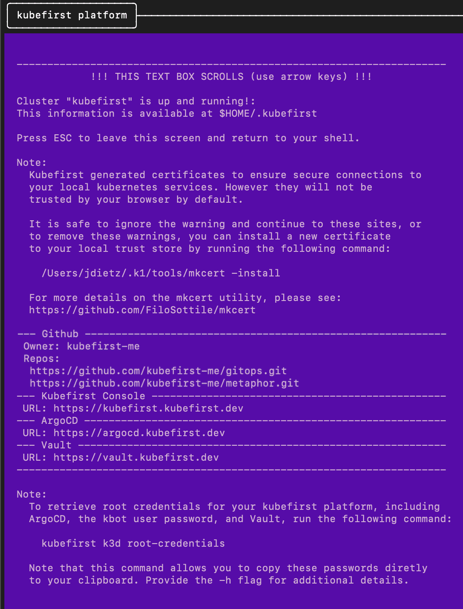

# Local Platform Installation with GitHub

`kubefirst` is the name of our CLI that installs the platform of the same name to your local or cloud environment.


## Prerequisites

- [Install](../../overview.md#install-the-kubefirst-cli) the kubefirst CLI.
- [Install](https://docs.docker.com/get-docker/) Docker Desktop.
- Create or use an actual [GitHub](https://github.com) personal account

### Install the CA (Certificate Authority) of mkcert in your trusted store

We use [mkcert](https://github.com/FiloSottile/mkcert) to generate local certificates and serve `https` with the Traefik Ingress Controller. During the installation, kubefirst generates these certificates and pushes them to Kubernetes as secrets to attach to Ingress resources.

To allow the applications running in your kubefirst platform in addition to your browser to trust the certificates generated by your kubefirst local install, you need to install the CA (Certificate Authority) of mkcert in your trusted store. To do so, follow these simple steps:

```shell
brew install mkcert
mkcert -install
```

This is not an optional step: the cluster creation will fail if you don't install the mkcert CA in your trusted store.

## Create your new local cluster

To create a new kubefirst cluster locally, run

```shell
kubefirst k3d create
```

Details about your execution will be logged to your `~/.k1/logs` directory. More information on `kubefirst k3d`, including optional flags, can be discovered by running `kubefirst k3d help`.

We are able to create an ephemeral GitHub token that expires after 8 hours using a process that will prompt your browser to request access to your account. If you need a quick environment, this is a frictionless approach. However, if you need this environment for longer than 8 hours, which is probably the case, please follow our [GitHub Token Guide](../../../explore/github-token.md) and export a more permanent token to your terminal by using the following command:

```shell
export GITHUB_TOKEN=ghp_xxxxxxxx
```

When Docker is provided 5 GB of memory and 5 CPUs, the local kubefirst platform will provision in about 6 minutes and deprovision in about 1 minute.

### Installed Applications

To see what is installed by kubefirst, check the [overview page](../../index.mdx).

## After installation

After the ~5 minute installation, your browser will open a new browser tab at completion with the Console UI at [https://kubefirst.kubefirst.dev](https://kubefirst.kubefirst.dev) to provide you an easy way to navigate through the different services that were provisioned.

## Console UI Screen


## Example of terminal output following cluster creation



## Root credentials

To obtain your 3 initial passwords, run

```bash
kubefirst k3d root-credentials
```


:::note the `kubefirst k3d root-credentials` command was introduced in 2.0.1

## Connecting to Kubernetes

You will be automatically connected to your new Kubernetes cluster. To view all cluster pods, run

```bash
kubectl get pods -A
```