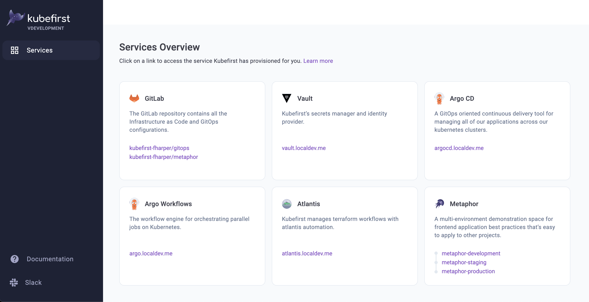

import CommonRootCredentialsCmd from "../../../common/partials/common/_root-credentials-cmd.mdx";
import GitLabHandoffScreen from "../../../img/local/gitlab/handoff-screen.png";
import CommonTerminalOutput from "../../../common/partials/common/_terminal-output.mdx";

# Local Platform Installation with GitLab

`kubefirst` is the name of our CLI that installs the platform of the same name to your local or cloud environment.


## Prerequisites

### Local Prerequisites

If you are on macOS, and have [Homebrew](https://brew.sh) installed, you can run:

```shell
brew install kubefirst/tools/kubefirst
```

To upgrade an existing kubefirst CLI to the latest version run:

```shell
brew update
brew upgrade kubefirst
```

There are other ways to install kubefirst for different operating systems, architectures, and containerized environments. See our [installation README](https://github.com/kubefirst/kubefirst/blob/main/build/README.md) for details.

### Docker Desktop

[Install](https://docs.docker.com/get-docker/) Docker Desktop.

### GitLab

- Create or use an existing [GitLab account](https://gitlab.com).
- Create a [GitLab group](https://docs.gitlab.com/ee/user/group/) developer permissions.

> GitLab SaaS offering has limitations that require us to use groups contrary to GitHub which can be use without an organization.

### Install the CA (Certificate Authority) of mkcert in your trusted store

We use [mkcert](https://github.com/FiloSottile/mkcert) to generate local certificates and serve `https` with the Traefik Ingress Controller. During the installation, kubefirst generates these certificates and pushes them to Kubernetes as secrets to attach to Ingress resources.

To allow the applications running in your kubefirst platform in addition to your browser to trust the certificates generated by your kubefirst local install, you need to install the CA (Certificate Authority) of mkcert in your trusted store. To do so, follow these simple steps:

```shell
brew install mkcert
mkcert -install
```

This is not an optional step: the cluster creation will fail if you don't install the mkcert CA in your trusted store.

## Working without SSH

If you need your kubefirst installation to avoid using SSH whenever possible, you can bypass SSH and kubefirst will configure itself, GitHub Actions, Argo CD, and your entire GitOps workflow to utilize HTTPS instead of SSH at all times.

Provide the flag `--git-protocol https` when building your k3d cluster and kubefirst will take care of the rest.

If you ever need to change this, you will need to rebuild the cluster or manually update the templates in your `gitops` repository.

## Create your new local cluster

To create a new kubefirst cluster locally, run

```shell
kubefirst k3d create \
  --git-provider gitlab \
  --gitlab-group your-group \
  --cluster-name kubefirst
```

Details about your execution will be logged to your `~/.k1/logs` directory. More information on `kubefirst k3d`, including optional flags, can be discovered by running `kubefirst k3d help`.

We are able to create an ephemeral GitLab token that expires after 8 hours using a process that will prompt your browser to request access to your account. If you need a quick environment, this is a frictionless approach. However, if you need this environment for longer than 8 hours, which is probably the case, please follow our [GitHub Token Guide](../../../common/git-auth.mdx) and export a more permanent token to your terminal by using the following command:

```shell
export GITLAB_TOKEN=gl_xxxxxxxx
```

When Docker is provided 5 GB of memory and 5 CPUs, the local kubefirst platform will provision in about 6 minutes and deprovision in about 1 minute.

<CommonTerminalOutput cloud="k3d"  minutes="7" handoffScreen={GitLabHandoffScreen} />

### Installed Applications

To see what is installed by kubefirst, check the [overview page](../../overview.mdx).

## Console UI Screen



<CommonRootCredentialsCmd />

## Connecting to Kubernetes

You will be automatically connected to your new Kubernetes cluster. To view all cluster pods, run

```shell
kubectl get pods -A
```
