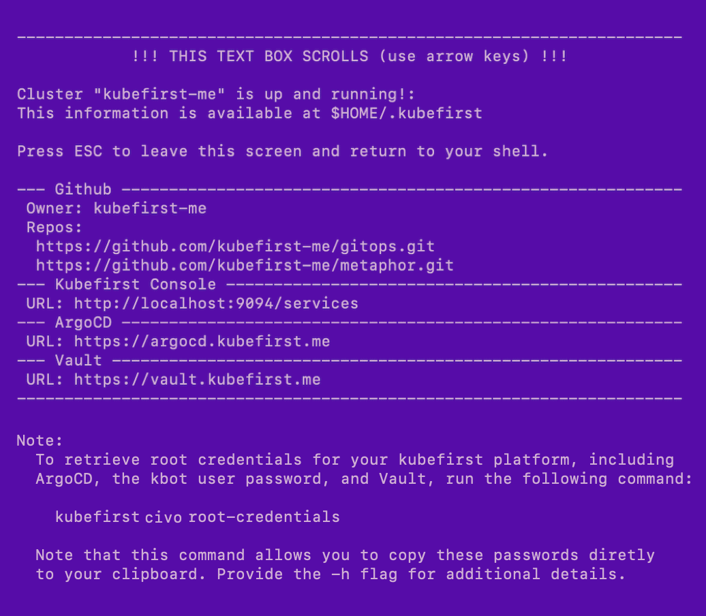

# Civo Platform Installation

`kubefirst` is our command line tool that installs a fully automated platform of open source cloud native tools to your Civo cloud with a simple `kubefirst civo create` command.


## Prerequisites

### Local Prerequisites

[Install](../../overview.md#how-to-install-kubefirst-cli) the kubefirst CLI.

### GitHub Prerequisites

- A GitHub [organisation](https://docs.github.com/en/organizations/collaborating-with-groups-in-organizations/creating-a-new-organization-from-scratch).
- A new GitHub [account](https://docs.github.com/en/get-started/signing-up-for-github/signing-up-for-a-new-github-account) for your `kbot` automation user.
- A GitHub [personal access token](../../../explore/github-token.md) for your `kbot` account.

### Civo Prerequisites

For kubefirst to be able to provision your Civo cloud resources:

- A [Civo account](https://dashboard.civo.com/signup) in which you are an account owner.
- A publicly routable [DNS](https://www.civo.com/learn/configure-dns#adding-a-domain-name).
- A [Civo token](https://dashboard.civo.com/security).

## Create your new kubefirst cluster

Adjust the following command with your GitHub and Civo tokens in addition to the appropriate values for your new platform.

```shell
export GITHUB_TOKEN=ghp_xxxxxxxxxxxxxxxx
export CIVO_TOKEN=xxxxxxxxxxxxxxxxxxxxxxxxxxxxxxxxxxxx
kubefirst civo create \
  --alerts-email yourdistro@your-company.io \
  --github-org your-github-org \
  --domain-name your-domain.io \
  --cluster-name kubefirst
```

The kubefirst cli will produce a directory of utilities, a state file, and some staged platform content that can now be found in the `~/.kubefirst` and `~/.k1` folders on your local machine.

After the ~10 minute installation, your browser will launch a new tab to the [kubefirst Console](https://github.com/kubefirst/console), which will help you navigate your new suite of tools running in your new Civo cluster.

If your deployment is not successful, errors and troubleshooting information will be stored in a local log file specified during the installation run.

## Example of terminal output following cluster creation



## Root credentials

To obtain your 3 initial passwords, run

```bash
kubefirst civo root-credentials
```


:::note the `kubefirst civo root-credentials` command was introduced in 2.0.1

## Connecting to Kubernetes

To connect to your new Kubernetes cluster, run

```bash
export KUBECONFIG=~/.k1/kubeconfig
```

To view all cluster pods, run

```bash
kubectl get pods -A
```

### Installed Applications

To see what is installed by kubefirst, check the [overview page](../../overview.md#platforms-details).
