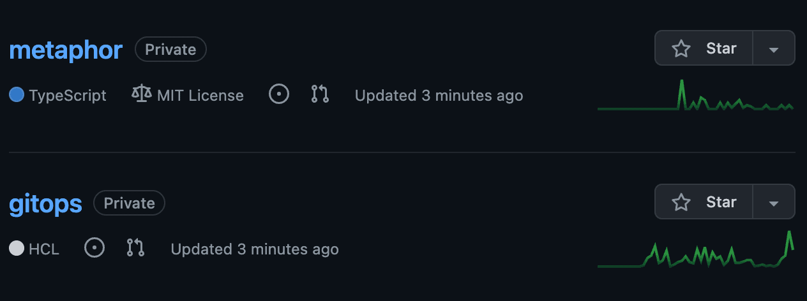

# GitHub Repositories

When you deploy a cluster on Civo using kubefirst, new repositories will be added to your organization's GitHub account.



## Repositories

### gitops

The `gitops` repository houses all of our IAC and all your GitOps configurations. The infrastructure created by kubefirst was produced by some combination of Terraform and Argo CD. You modify the infrastructure or add new applications to your cluster by creating a pull request to your new `gitops` repository.

### metaphor

`metaphor` is a suite of demo microservice applications to demonstrate how an application can be integrated into the kubefirst platform following best practices. It is described in more details [here](../../../explore/metaphor.md).

## Repositories Management

The repositories are being managed with Terraform. If you need additional ones, you need to add new section of Terraform code to `terraform/github/repos.tf`:

```terraform
# set auto_init to false if importing an existing repository
# true if it's a new repository

module "your_repo_name" {
  source = "./modules/repository"
  visibility         = "private"
  repo_name          = "your-repo-name"
  archive_on_destroy = true
  auto_init          = false
}
```

## Making Terraform Changes

To make infrastructure and configuration changes with Terraform, simply open a pull request against any of the Terraform directory folders in the `gitops` repository. Your pull request will automatically provide plans, state locks, and applies, and even comment in the merge request itself. You'll have a simple, peer reviewable, auditable changelog of all infrastructure and configuration changes.


