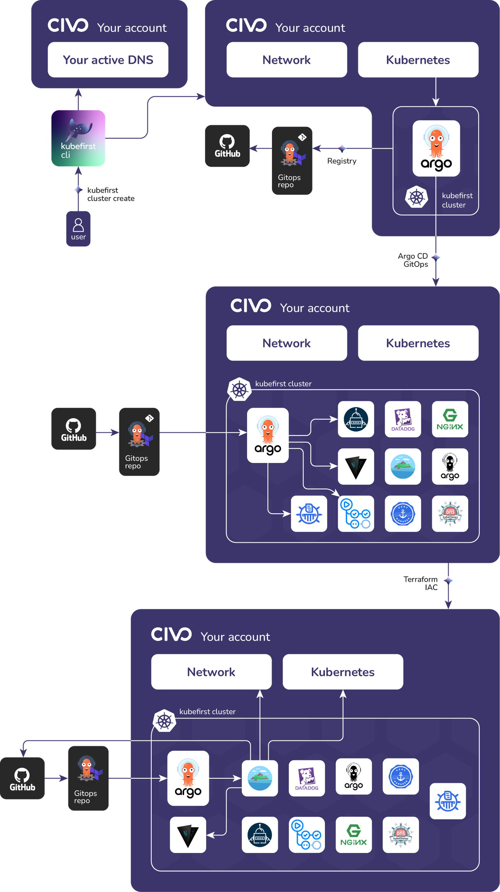

# Civo Platform Installation

`kubefirst` is our command line tool that installs a fully automated platform of open source cloud native tools to your Civo cloud with a simple command.



## Prerequisites

### Local Prerequisites

[Install](../../../kubefirst/overview.md#how-to-install-kubefirst-cli) the kubefirst CLI.

### GitLab Prerequesites

- A GitLab [user](https://docs.gitlab.com/ee/user/profile/account/create_accounts.html) for your `kbot` automation user.
- A GitLab [personal access token](https://docs.gitlab.com/ee/user/profile/personal_access_tokens.html)  for your `kbot` account.

### Civo Prerequisites

For kubefirst to be able to provision your Civo cloud resources:

- A [Civo account](https://dashboard.civo.com/signup) in which you are an account owner.
- A publicly routable [DNS](https://www.civo.com/learn/configure-dns#adding-a-domain-name).
- A [Civo token](https://dashboard.civo.com/security).

## Create your new kubefirst cluster

Adjust the following command with your GitHub and Civo tokens in addition to the appropriate values for your new platform.

```shell
export GITLAB_TOKEN=xxxxxxxxxxxxxxxx
export CIVO_TOKEN=xxxxxxxxxxxxxxxxxxxxxxxxxxxxxxxxxxxx

kubefirst civo create \
  --alerts-email yourdistro@your-company.io \
  --git-provider gitlab \
  --gitlab-group your-gitlab-group \
  --domain-name your-domain.io \
  --cluster-name kubefirst
```

The kubefirst cli will produce a directory of utilities, a state file, and some staged platform content that can now be found in the `~/.kubefirst` and `~/.k1` folders on your local machine.

After the ~6 minute installation, your browser will launch a new tab to the [kubefirst Console](https://github.com/kubefirst/console), which will help you navigate your new suite of tools running in your new Civo cluster.

If your deployment is not successful, errors and troubleshooting information will be stored in a local log file specified during the installation run.

### Installed Applications

To see what is installed by kubefirst, check the [overview page](../../overview.md#platforms-details).
