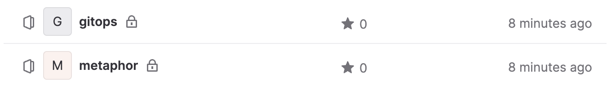

# GitLab Repositories

When you install the civo version of kubefirst, 2 new repositories will be added to your gitlab project as shown here.



## Repository Summary

### gitops

The GitOps repo houses all of our IAC and all our GitOps configurations. All of the infrastructure that you receive with Kubefirst was produced by some combination of Terraform and ArgoCD. You can add any infrastructure or application to your platform by pull requesting it to your new `gitops` repository.

### metaphor

`metaphor` is a suite of demo microservice applications to demonstrate how an application can be integrated into the kubefirst platform following best practices. It is described in more details [here](../../../explore/metaphor.md).

## GitLab Repository Management

These GitLab repositories are being managed in Terraform.
<!-- TODO: 2.0 - check path on next line -->
As you need additional GitLab repositories, just add a new section of Terraform code to `terraform/gitlab/repos.tf`:

<!-- TODO: 2.0 - check repo example -->
```terraform
# set auto_init to false if importing an existing repository
# true if it's a new repository

module "your_repo_name" {
  source = "./modules/repository"
  visibility         = "private"
  repo_name          = "your-repo-name"
  archive_on_destroy = true
  auto_init          = false
}
```

## Making Terraform Changes

To make infrastructure and configuration changes with Terraform, simply open a pull request against any of the terraform directory folders in the `gitops` repository. Your pull request will automatically provide plans, state locks, and applies, and even comment in the merge request itself. You'll have a simple, peer reviewable, auditable changelog of all infrastructure and configuration changes.

<!-- TODO: 2.0 - get gitlab image -->

