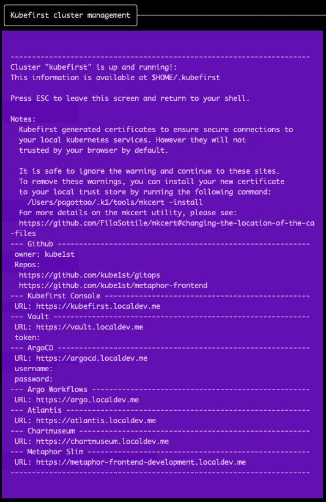

The `kubefirst k3d create` command will open a new browser tab at completion with the Console UI at [https://kubefirst.localdev.me](https://kubefirst.localdev.me) to provide you an easy way to navigate through the different services that were provisioned.

## Console UI Screen

<!-- TODO: [2.0] update with 2.0 console from local. -->

## Example of terminal output following cluster creation

<!-- TODO: [2.0] update with 2.0 terminal output from local. -->

