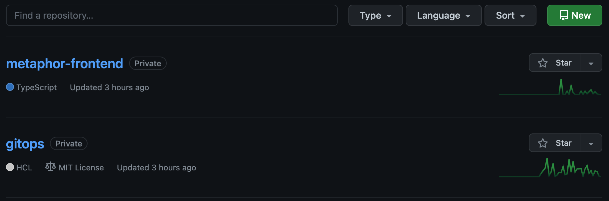
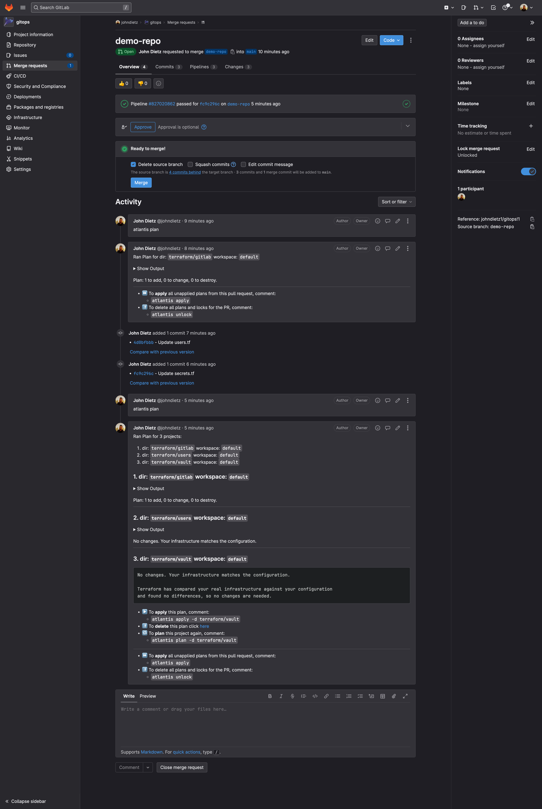

# GitHub Repositories

The `kubefirst k3d create` command will create a `gitops` and `metaphor` repository in your personal GitHub account as shown here.

<!-- TODO: 2.0 - new repo list - metaphor not metaphor-frontend-->


## Repositories Summary

### gitops

The `gitops` repository houses all of our IAC and all our GitOps configurations. All of the infrastructure and application configuration that are installed with kubefirst were produced by some combination of Terraform and Argo CD in the `gitops` repository. You will add to this repository to extend your infrastructure or add new applications.

### metaphor

`metaphor` is a suite of demo microservice applications to demonstrate how an application can be integrated into the kubefirst platform following best practices. It is described in more details [here](../../../explore/metaphor.md).

## Repositories Management

As you need additional GitHub repositories, just add a new section of Terraform code to `terraform/github/repos.tf` in your new `gitops` repository:

```terraform
module "your_repo_name" {
  source = "./modules/repository"
  visibility         = "private"
  repo_name          = "your-repo-name"
  archive_on_destroy = true
  auto_init          = false # set to false if importing an existing repository, set to true if brand new
}
```

GitHub's Terraform provider give you access to many more configuration options than just these settings. More information about those in the `Resources` section of the GitHub provider [documentation](https://registry.terraform.io/providers/integrations/github/latest/docs).

## Making Changes with Terraform

To make infrastructure and configuration changes with Terraform, simply open a pull request in the `gitops` repository. Your pull request will automatically provide plans, state locks, and applies, and even comment in the pull request itself. You'll have a simple, peer reviewable, auditable changelog of all infrastructure and configuration changes.


