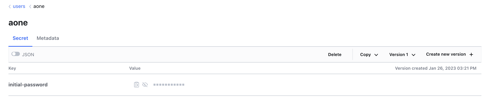

In this tutorial we will show how to add users to your local cluster through [Atlantis](https://www.runatlantis.io/), which will allow a preview of how changes made will be expressed through Terraform before branches are merged into your repository.

Navigate to the `gitops` repository in your personal GitHub account, clone the contents, and create a new branch:

```shell
cd gitops
git checkout -b new-user
```

The folder `k3d-github/terraform/users/admins` contains two separate files that represent admin users: `admin-one.tf` (commented-out), and the `kubefirst_bot` user. Here's the module from `admin-one.tf`:

```terraform
module "admin_one" {
  source = "./modules/user/github"

  acl_policies            = ["admin"]
  email                   = "your.admin@your-company.io"
  first_name              = "Admin"
  github_username         = "admin-one-github-username"
  last_name               = "One"
  team_id                 = data.github_team.admins.id
  username                = "aone"
  user_disabled           = false
  userpass_accessor       = data.vault_auth_backend.userpass.accessor
}
```

Uncomment and edit this code to replace the values for the `email`, `first_name`, `github_username`, `last_name`, and `username` before pushing to your branch.

```shell
git add .
git commit -m feat: add new user
git push --set-upstream origin new-user
```

Now, create a pull request. This will kick off the Atlantis workflow. Within a minute or so, a comment will appear on the pull request that shows the Terraform plan with the changes it will be making to your infrastructure.


To apply these changes, you or someone in the organization can submit a comment on that pull request with the following text: `atlantis apply`. Doing so will instruct Atlantis to apply the plan. It will report back with the results within a minute or so.

> Atlantis merges your Pull Request automatically once an apply is successfully executed. Don't merge Terraform pull requests yourself. Atlantis will always run plans automatically for you when a pull request is opened that changes files mapped in `atlantis.yaml`.

Any new users you have created through this process will have their temporary initial passwords stored in your local [HashiCorp Vault](https://argocd.localdev.me/applications/vault) cluster. You can also access Vault using the information provided to you in the terminal: you will find your users' individual initial passwords in the Vault secret store `/secrets/users/<username>`.


Once you've provided them their initial password, they can update it throughout the platform by modifying their user password entity in Vault. Anyone can change their own password, and admins can reset anyone's password. These rules, just like everything else on kubefirst, can be configured in your new gitops repository.



The existence of a new user with your specified parameters demonstrates that you have successfully updated your users using Atlantis!

### Troubleshooting Atlantis

<!-- TODO: [2.0] this warning is being spiked actively to see if we can remove it from the system as a part of the 2.0 release. confirm when releasing. -->
The ngrok tunnel used for kubefirst local has a 2-hour expiration unless you create an account with ngrok. This expiration will prevent you from using automated infrastructure as code through Atlantis, but the rest of the platform will continue to function beyond that ngrok evaluation period. Create a [ngrok account](https://dashboard.ngrok.com/signup) to prevent this.

Atlantis works by sending a webhooks to Atlantis from your gitops repository. If you're not receiving Terraform plan comments, check the webhooks section of your `gitops` repository settings and review the responses from the sent webhook requests.
