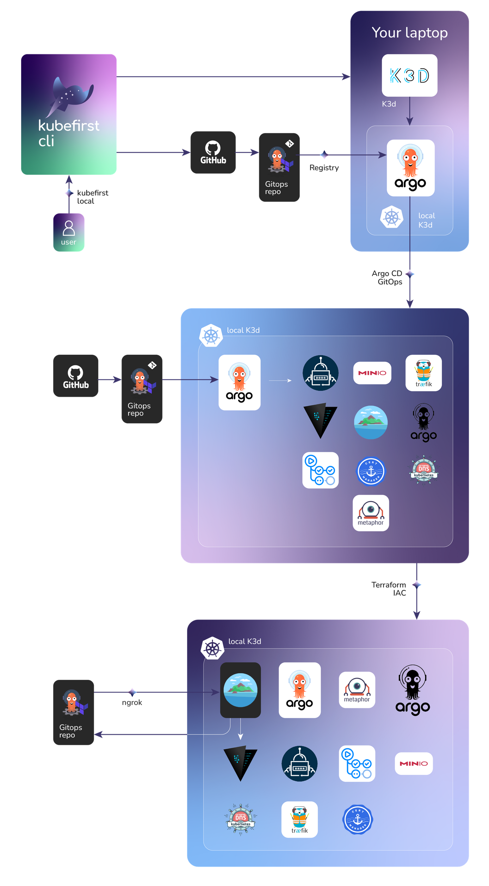
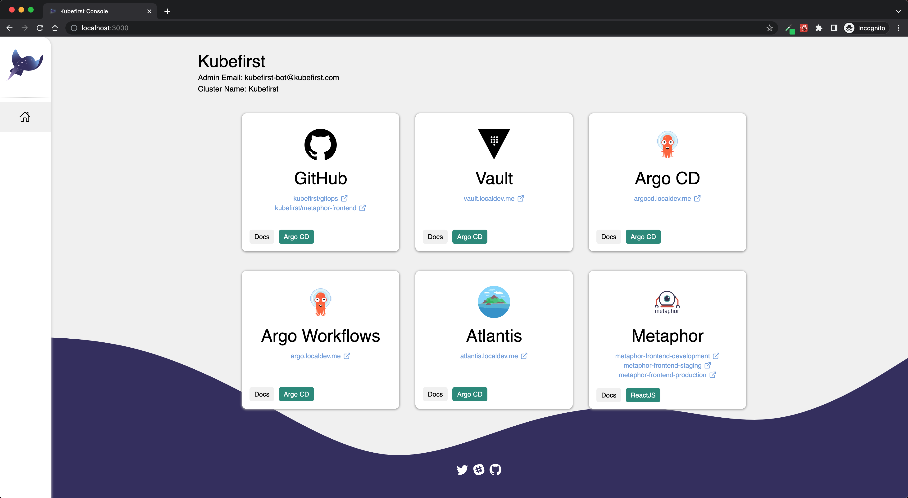
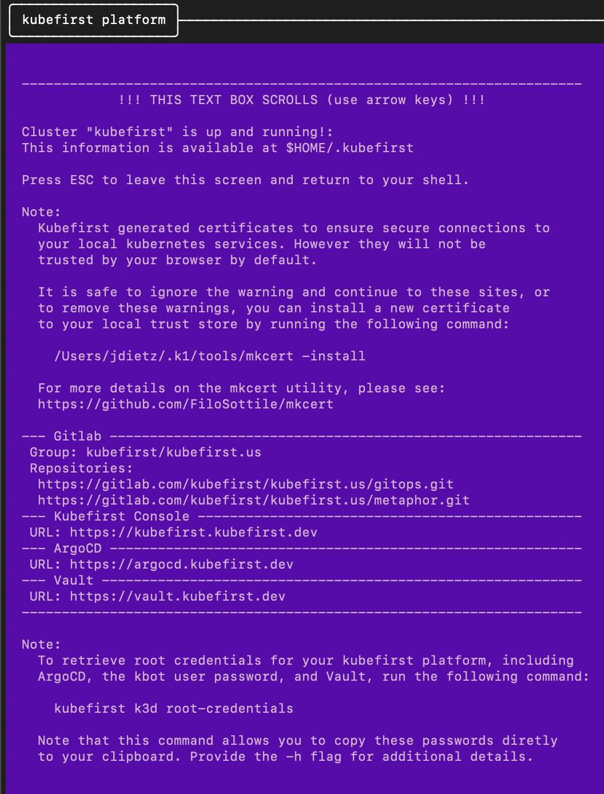

# Local Platform Installation with GitLab

`kubefirst` is the name of our CLI that installs the platform of the same name to your local or cloud environment.



## Prerequisites

- [Install](../overview.md#how-to-install-kubefirst-cli) the kubefirst CLI.
- [Install](https://docs.docker.com/get-docker/) Docker Desktop.
- Create or use an existing [GitLab account](https://gitlab.com)
- Create a [GitLab group](https://docs.gitlab.com/ee/user/group/)

> GitLab SaaS offering has limitations that require us to use groups contraty to GitHub which can be use without an organization.

## Create your new local cluster

To create a new kubefirst cluster locally, run

```shell
kubefirst k3d create \
  --git-provider gitlab \
  --gitlab-owner your-group \
  --cluster-name kubefirst
```

Details about your execution will be logged to your `~/.k1/logs` directory. More information on `kubefirst k3d`, including optional flags, can be discovered by running `kubefirst k3d help`.

<!-- TODO: [2.0] the above warning is being spiked actively to see if we can remove it from the system as a part of the 2.0 release. confirm when releasing. -->
> **2 Hour Expiration Warning**
> The ngrok tunnel used for kubefirst local has a 2-hour expiration unless you [create a ngrok account](https://dashboard.ngrok.com/signup). This expiration will prevent you from using automated infrastructure as code through Terraform Atlantis, but the rest of the platform will continue to function beyond that ngrok evaluation period.

We are able to create an ephemeral GitLab token that expires after 8 hours using a process that will prompt your browser to request access to your account. If you need a quick environment, this is a frictionless approach. However, if you need this environment for longer than 8 hours, which is probably the case, please follow our [GitHub Token Guide](../../../explore/gitlab-token.md) and export a more permanent token to your terminal by using the following command:

```shell
export GITLAB_TOKEN=gl_xxxxxxxx
```

When Docker is provided 5 GB of memory and 5 CPUs, the local kubefirst platform will provision in about 6 minutes and deprovision in about 1 minute.

### Installed Applications

To see what is installed by kubefirst, check the [overview page](../../overview.md#platforms-details).

### ngrok & Atlantis Integrations

<!-- TODO: 2.0 - check the legitimacy of the above before releasing docs -->
[ngrok](https://ngrok.com/) is a tool that allows kubefirst to expose a local server to the internet via [ngrok Secure Tunnels](https://ngrok.com/docs/secure-tunnels/). kubefirst opens an ngrok Secure Tunnel tunnel during the installation to send events to Atlantis. When the installation finishes, the terminal window hangs at the handoff screen. If the handoff screen in your terminal is closed, the Kubefirst installation terminates and the Ngrok Secure Tunnel is closed.

During cluster provisioning, Terraform communicates with the host machine to create the desired resources. When Atlantis is installed via kubefirst, it will use ngrok to expose the Atlantis server to the internet via [webhooks](https://zapier.com/blog/what-are-webhooks/).

## After installation

After the ~5 minute installation, your browser will open a new browser tab at completion with the Console UI at [https://kubefirst.localdev.me](https://kubefirst.localdev.me) to provide you an easy way to navigate through the different services that were provisioned.

## Console UI Screen

<!-- TODO: [2.0] update with 2.0 console from local & GitLab -->


## Example of terminal output following cluster creation



## Install the CA (Certificate Authority) of mkcert in your trusted store (optional)

We use [mkcert](https://github.com/FiloSottile/mkcert) to generate local certificates and serve `https` with the Traefik Ingress Controller. During the installation, kubefirst generates these certificates and pushes them to Kubernetes as secrets to attach to Ingress resources.

To allow the applications running in your kubefirst platform in addition to your browser to trust the certificates generated by your kubefirst local install, you need to install the CA (Certificate Authority) of mkcert in your trusted store. To do so, follow these simple steps:

```shell
brew install mkcert
mkcert -install
```
