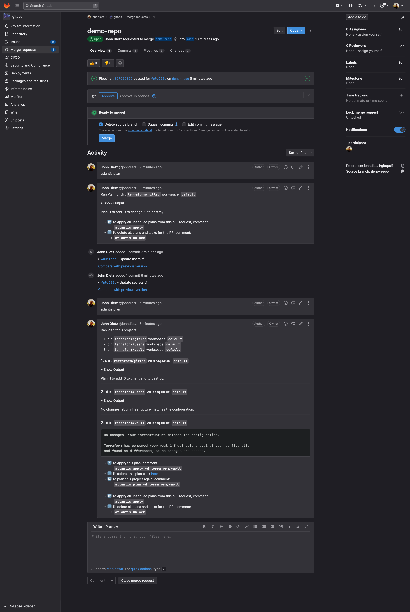

# GitLab Repositories

The `kubefirst k3d create` command will create a `gitops` and `metaphor` repository in your personal github account as shown here.


## Repository Summary

### gitops

The `gitops` repo houses all of our IAC and all our GitOps configurations. All of the infrastructure and application configutation that you receive with Kubefirst was produced by some combination of Terraform and Argo CD in the `gitops` repository. You will add to this repository as extend your infrastructure or new applications.

### metaphor

`metaphor` is a suite of demo microservice applications to demonstrate how an application can be integrated into the kubefirst platform following best practices. It is described in more details [here](../../../explore/metaphor.md).

## GitLab Repository Management

As you need additional GitHub repositories, just add a new section of Terraform code to `terraform/gitlab/repos.tf` in your new gitops repository:

```terraform
module "your_repo_name" {
  source = "./modules/repository"
  visibility         = "private"
  repo_name          = "your-repo-name"
  archive_on_destroy = true
  auto_init          = false # set to false if importing an existing repository, set to true if brand new
}
```

GitLab's Terraform provider provides many more configuration options than just these settings. Check them out and add to your default settings once you're comfortable with the platform.

## Making Terraform Changes

To make infrastructure and configuration changes with Terraform, simply open a merge request in the `gitops` repository. Your merge request will automatically provide plans, state locks, and applies, and even comment in the merge request itself. You'll have a simple, peer reviewable, auditable changelog of all infrastructure and configuration changes.

<!-- TODO: 2.0 - need atlantis pull request gitlab image -->
<!--  -->
