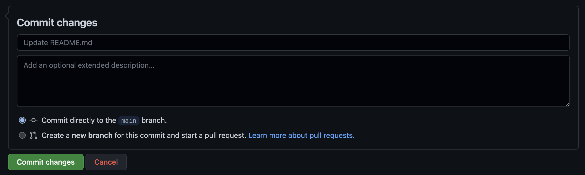
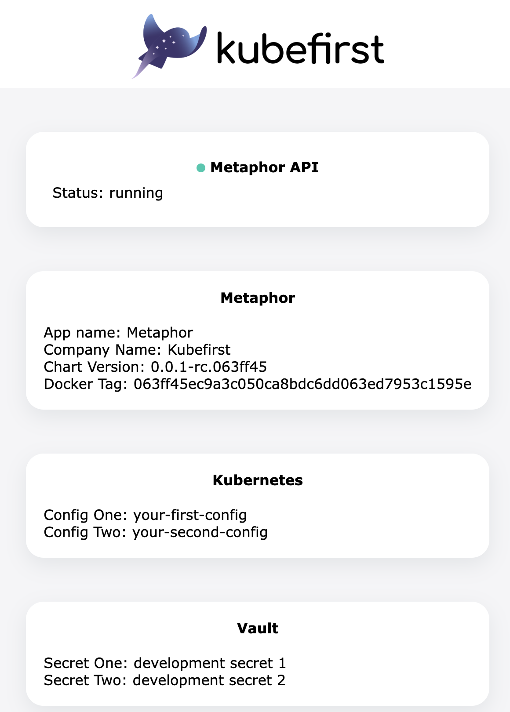

The `metaphor` repo is a simple sample microservice with source code, build, and delivery automation that we use to demonstrate parts of the platform. We also find it to be a valuable way to test CI changes without impacting real apps on your platform.

If you visit your `/.github/workflows/main.yaml` in the `metaphor` repository, you'll see that it's just sending some workflows to Argo Workflows in your local k3d cluster.

The example delivery pipeline is:

- Publish the metaphor container to your private GitHub.
- Add the metaphor image to a release candidate Helm chart and publish it to ChartMuseum.
- Set the metaphor application with the desired Helm chart version in the GitOps repository for development and staging.
- Republish the chart with the release stage, this time without the release candidate notation making it an officially released version and prepare the metaphor application chart for the next release.
- Set the officially released metaphor chart as the desired Helm chart for production.

To watch this pipeline occur, make any change to the `main` branch of the `metaphor` repository.  Once a file in `main` is changed, navigate to metaphor's CI/CD in the GitHub `Actions` tab to see the workflows get submitted to Argo Workflows.

You can visit the metaphor development, staging, and production applications in your browser to see the versions change as you complete resources and Argo CD syncs the apps. The metaphor URLs can be found in your gitops and metaphor repositories `README.md` files.

<!-- TODO: 2.0 - image update - metaphor facelift & make smaller -->

