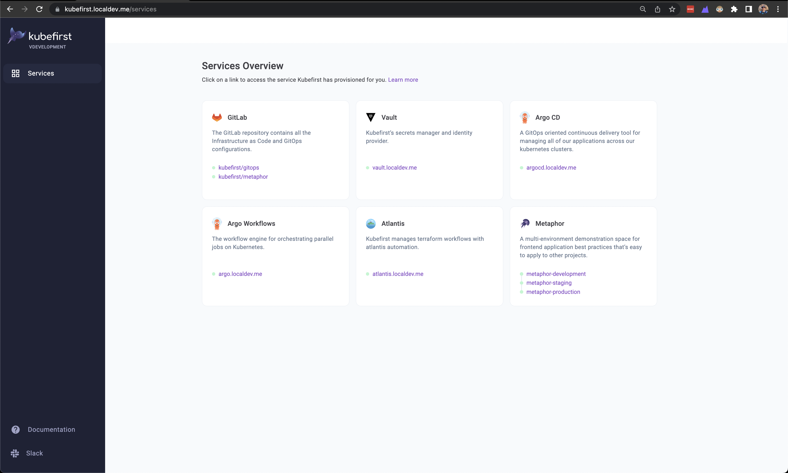

## How to install Kubefirst CLI

```shell
brew install kubefirst/tools/kubefirst
```

There are a few other ways to install Kubefirst for different operating systems, architectures, and containerized environments. See our [installation README](https://github.com/kubefirst/kubefirst/blob/main/build/README.md) for non-brew details.

To upgrade an existing Kubefirst install to the latest version run

```shell
brew update
brew upgrade kubefirst
```

## Kubefirst Usage

- The `kubefirst` CLI runs on your localhost and will create an GitLab or GitHub kubernetes ecosystem including Vault, ArgoCD, Argo Workflows, self-hosted runners for GitHub and GitLab, and an application to demonstrate how everything on the platform works.
- We have local, AWS, and Civo platforms available.
- The install takes about 30 minutes to execute on AWS, 6 minutes on Civo, and 5 minutes on local.
- Your GitLab or GitHub space will receive a new `gitops` and `metaphor` repository.
- All of the infrastructure as code will be in your `gitops` repository in the `/terraform` directory. IAC workflows are fully automated with Atlantis by merely opening a merge request against the `gitops` repository.
- All of the applications running in your Kubernetes cluster are registered in the gitops repository in the root `/registry` directory.
- The metaphor repositories only needs an update to the main branch to deliver the example application to your new development, staging, and production environments. It will hook into your new Vault for secrets, demonstrate automated certs, automated DNS, and GitOps application delivery. Our CI/CD is powered by Argo CD, Argo Workflows, GitLab or GitHub, and Vault.

## Platforms

|   | local + github | local + gitlab | aws + github | aws + gitlab | civo + github | civo + gitlab |
|:--|:--:|:--:|:--:|:--:|:--:|:--:|
|how to use | `kubefirst k3d create` | `kubefirst k3d create --git-provider gitlab` | `kubefirst aws create` | `kubefirst aws create --git-provider gitlab` | `kubefirst civo create` | `kubefirst civo create --git-provider gitlab` |
|argocd | yes | yes | yes | yes | yes | yes |
|argo workflows | yes | yes | yes | yes | yes | yes |
|vault | yes |  yes | yes, backed with DynamoDB and KMS| yes, backed with DynamoDB and KMS| yes | yes |
|atlantis | yes | yes | yes | yes | yes | yes |
|metaphor | yes | yes | yes | yes | yes | yes |
|chartmuseum | yes | yes | yes | yes |
|self-hosted runner | actions-runner-controller | gitlab-runner | actions-runner-controller | gitlab-runner | actions-runner-controller | gitlab-runner |
|HTTPS/SSL Certificates | mkcert | mkcert | let's encrypt | let's encrypt | let's encrypt | let's encrypt |
|external-secrets-operator | yes | yes | yes | yes | yes | yes |
|kubefirst console| yes | yes | yes| yes | yes | yes |
|oidc | no | no | yes | yes | yes | yes |

## Kubefirst Console

### AWS or Civo Console UI

Once you run `kubefirst <platform> create` command, a new brower tab will launch with your Kubefirst Console to provide you a launch page provide access to the different services that were provisioned.



## Destroying

Each kubefirst provisioning command also comes with a `kubefirst <platform> destroy` command to make it easy to destroy any provisioned infrastructure.

## Learn more

- Learn more about the kubefirst platform tools [here](../explore/overview.md)
- Explore with the [local github](./local/github/install.md) or [local github](./local/gitlab/install.md) install

## Credit

[Open source projects used on Kubefirst](./credit.md)
