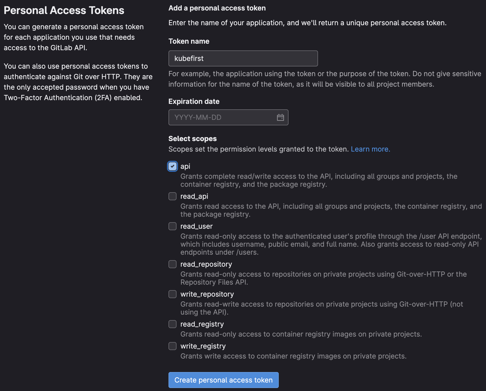

kubefirst uses a GitLab token to authenticate with the GitLab API. Tokens can be used to perform various actions on a user's behalf, such as creating, and deleting repository files. kubefirst uses a limited number of scopes (what is allowed with the issued token) to provision the kubefirst platform such as creating GitLab repositories and updating GitLab repository webhook URL.

kubefirst issue GitLab Tokens at the beginning of the installation using [GitLab device login flow](https://docs.gitlab.com/ee/api/oauth2.html).

## GitLab Token Scopes

kubefirst uses the following scopes to provision the kubefirst platform:

## How to create a GitLab Token

There are different ways to create a GitLab token. The easiest way is to start the kubefirst installer, and follow the screen instructions. It will guide you to issue a token with the list of scope described above.

There are other ways to create a GitLab token. You can login into your GitLab account and issue a Personal Access Token following the list of scopes above. With the manually generated token, you can provide it via environment variable: `export GITLAB_TOKEN`.
