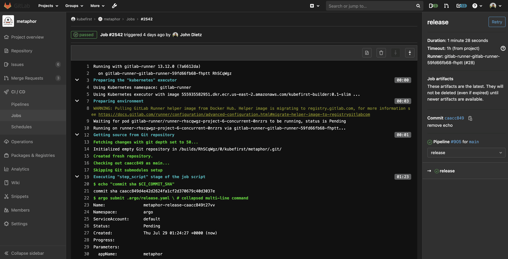

# Kubefirst GitOps CI/CD

The days of scripting `kubectl apply` and `helm install` in your operations are over. The kubefirst platform comes with all the tools you need to run a scalable gitops platform powered by Argo CD GitOps.


## The Benefits of GitOps

The benefit of defining your desired state in a declarative way in Git is enormous.

- An audit log of every system change including who made and who approved the change is available.
- A secure main branch of the GitOps repo makes for very easy security and approval controls for system changes.
- Easy to understand rollbacks (just revert the Git commit that caused the problem and you'll be on the last version).
- The declarative state in Git significantly reduces the complexity of disaster recovery.
- Creating new environments is as straight-forward as duplicating directory structures.
- Having everything declared in the GitOps repo means everyone can agree to the source of truth for every version of every app.

## Pipelines


Our CI pipelines originate in your privately hosted git repo trigger mechanism(Github Actions or Gitlab CI) with a workflow being submitted to Argo Workflows. The workflows will publish your container with a pre-release Helm chart.

The pipelines then continue with promotion of the release through the preprod environments.

Once the release is ready, the release chart is published and delivered to production, and the application chart's version will be prepared for the next release.

### GitHub Integration with Argo Workflows


The integration that we've established between GitHub and Argo Workflows will surface your powerful Argo Workflows engine directly in GitHub Actions, so that your developers have all of the workflow execution information available, directly associated with their commit in their application repository.

### GitLab Integration with Argo Workflows



The integration that we've established between GitLab and Argo Workflows will surface your powerful Argo Workflows engine directly in GitLab's native CI, so that your developers have all of the workflow execution information available directly associated with their commit in their application repository.


## GitOps Resources

Our registry includes GitOps patterns for numerous source types including:

- Helm Charts
- Wrapper Charts
- Kubernetes Manifest Files

The metaphor example application includes an example of how easy it is to set different configuration overrides for your different environments.

To see what it takes to make the `development` instance of `metaphor` different than the others, visit the `gitops` repo and navigate to `/components/development/metaphor/values.yaml`

Any Helm value that should deviate from the default chart can be set here so your environment overrides are always concise and clear.

## Using Your Own gitops-template Repository Fork

If you want to customize the template before creating a new cluster, you can fork the [gitops-template repository](https://github.com/kubefirst/gitops-template), and use it as the source for cluster creation. To do so, follow the [forking instructions from GitHub](https://docs.github.com/en/get-started/quickstart/fork-a-repo). Note that the tags won't follow, and they are needed for the CLI to properly function. [Clone your new repository](https://docs.github.com/en/repositories/creating-and-managing-repositories/cloning-a-repository) locally, and once inside the repository folder, run the following commands in your terminal to update your repository with the tags:

```shell
# Replace <yourusername> by your GitHub username or the organization into which you fork gitops-template
# If you give another name to your gitops-template repository, update it also
git remote add upstream git@github.com:<yourusername>/gitops-template.git
git fetch upstream
git push --tags
```

Now you can use the `--gitops-template-url` flag pointing to your new repository when creating a new Kubernetes cluster.
