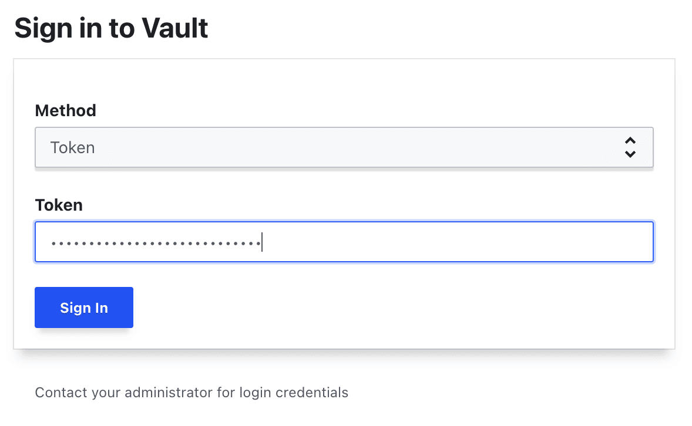
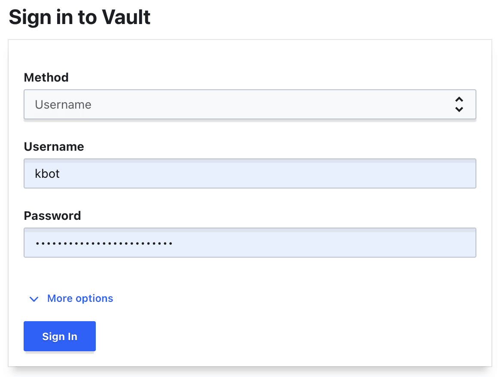
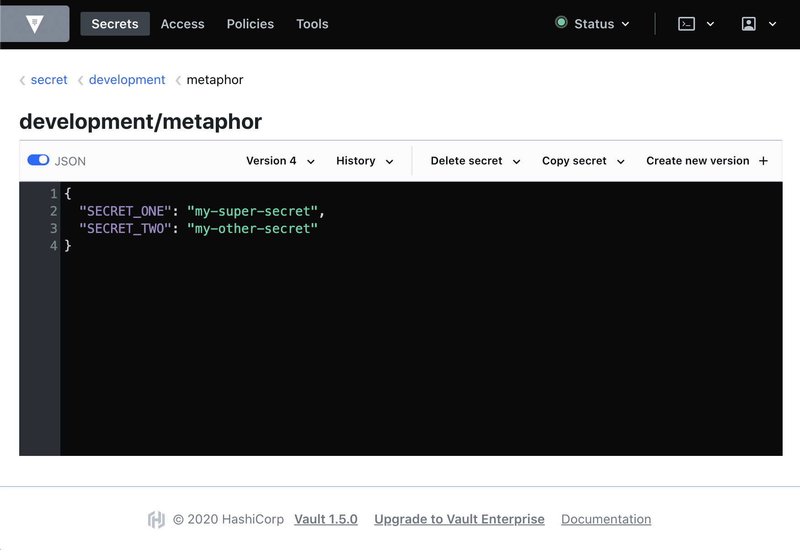
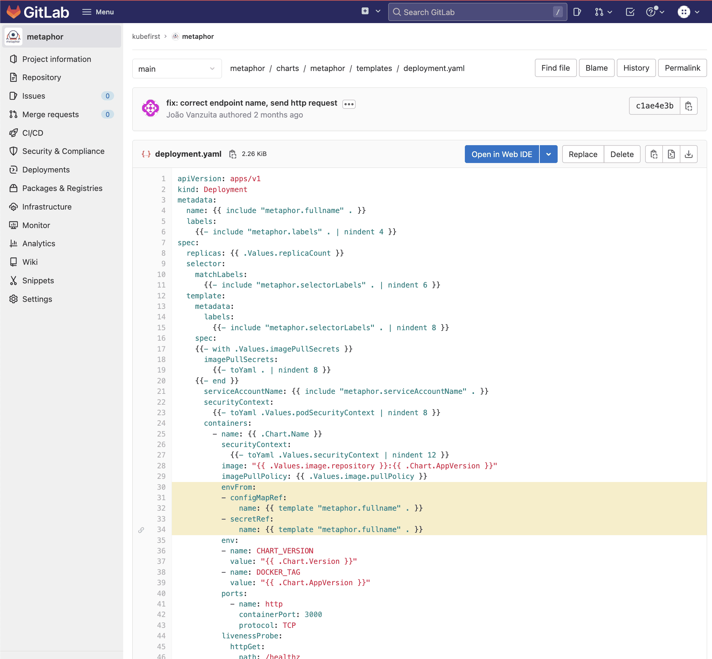

[Vault](https://www.vaultproject.io) is an open source secrets manager and identity provider created by HashiCorp.

## Vault for AWS install

If you run `kubefirst cluster create --cloud aws`  kubefirst will install Vault and provision a [DynamoDB](https://aws.amazon.com/dynamodb/) backend that's encrypted with [AWS KMS](https://aws.amazon.com/kms/) with point in time recovery enabled.

Your infrastructure will be set up with Vault running in the EKS cluster. It will come with multiple Authentication Backends enabled.

## Vault for local install

For local it's backed by a local S3-like backend in [MinIO](https://min.io/) and it is a Vault in development mode. It is meant to help to board developers to the Vault integrations experience without the overhead of a full install setup to save resources.

```yaml
          dev:
            enabled: true
            devRootToken: "k1_local_vault_token"
```

Reference: [vault deployment](https://github.com/kubefirst/gitops-template/blob/main/k3d-github/cluster-types/mgmt/components/vault/application.yaml)

Your cluster will be set up with Vault running in the k3d cluster. The only backend enabled on the local cluster is the one that provides access to secrets from external-secrets-operator.

### Token authentication


Your first login to Vault will be with the root token which has full administrative permissions. As mentioned in the handoff screen (the purple screen at the end of the installation), it is sotred in a secret named `vault-unseal-secret`, which is in the `vault` namespace of your newly deployed cluster. To read the value, use [kubectl](https://kubernetes.io/docs/tasks/tools/#kubectl) (which is already in the `~/.k1/` tools folder), and run the following command:

```shell
~/.k1/tools/kubectl -n Vault get secrets/vault-unseal-secret --template='{{index .data "root-token"}}' | base64 -d
```

It will output the root token. Copy it, then open your browser, and navigate to your Vault instance. Select `Token` and paste the value into the password field.



While logged in with the root token, navigate to the secret at `Users -> kbot`. This secret is the username, and OIDC password for the kubefirst bot user named `kbot`. Copy the value, log out of Vault and use it to authenticate with this user in the next section.

### Username authentication (human users)

When logging in with users instead of tokens, select method `Username` as the login method on the login screen. Enter `kbot` as the username, and paste the password you collected in the Password field and log in.



This is the login experience that your team will use when authenticating with Vault. Initially, there will only be a singular `kbot` user created that represents the kubefirst bot account. You can pull request additional admins and developers from your team onto the platform, and they will all log in using the Username method.

Once a user is logged into Vault with Username auth, they will be automatically provided single-sign-on access to argo workflows, argo cd, console, and gitlab applications.

### Kubernetes authentication

The `external-secrets-operator` application will be preconfigured with a service account that can pull secrets from your cluster's Vault instance. This is accomplished by leveraging the `kubernetes/kubefirst/` auth backend. By default, external-secrets will be able to pull your cluster secrets, and make them available as native Kubernetes secrets for your applications to leverage.

### Additional auth methods

There are other authentication schemes available to you as well: [https://www.vaultproject.io/docs/auth](https://www.vaultproject.io/docs/auth)

## Secrets Setup for Applications

### Storing secrets in Vault

While logged into Vault, navigate to secrets path `secret/development/metaphor`.



Here you can see we have two secrets stored at named `SECRET_ONE` and `SECRET_TWO` with two "secret values". These two values are obviously not actually sensitive and are for demonstration purposes only. Let's explore how secrets work.

### Creating Kubernetes Secrets From Vault Secrets

If you look in your new metaphor repository in GitLab or GitHub, you'll find a helm template file at path `metaphor/charts/metaphor/templates/external-secrets.yaml`

```yaml
apiVersion: "external-secrets.io/v1alpha1"
kind: ExternalSecret
metadata:
  name: {{ template "metaphor.fullname" . }}
  labels:
    chart: "{{ .Chart.Name }}-{{ .Chart.Version | replace "+" "_" }}"
spec:
  target:
    name: {{ template "metaphor.fullname" . }}
  secretStoreRef:
    kind: ClusterSecretStore
    name: Vault-secrets-backend
  refreshInterval: "10s"
  data:
    - remoteRef:
        key: {{ .Values.vaultSecretPath }}
        property: SECRET_ONE
      secretKey: SECRET_ONE
    - remoteRef:
        key: {{ .Values.vaultSecretPath }}
        property: SECRET_TWO
      secretKey: SECRET_TWO
```

This is going to be a very common file type for you on the kubefirst platform. This Kubernetes resource deploys with metaphor, connecting to the `vault-secrets-backend` cluster secret store, and pulls secrets from the path specified in the values.yaml property `vaultSecretPath`. You can either pull all secrets from Vault into the Kubernetes secret, or as this secret demonstrates, you can also specify exactly which specific key/value pairs to pull when creating the secret.

The result will be a native Kubernetes secret, which can be used by your application. Since the path is driven by helm values.yaml values, the source for these secrets can be different in your different environments. For example, when you go to your gitops repository and look at `gitops/components/staging/metaphor/values.yaml` you'll see on the last line that we're pulling the staging secrets from the staging path in Vault.

```yaml
metaphor:
  ingress:
    enabled: true
    annotations:
      Kubernetes.io/ingress.class: nginx
      cert-manager.io/cluster-issuer: "letsencrypt-prod"
    hosts:
      - host: metaphor-staging.feedkray.com
        paths:
          - /
    tls:
    - secretName: metaphor-tls
      hosts:
        - metaphor-staging.feedkray.com
  VaultMountPoint: kubefirst
  VaultSecretPath: staging/metaphor
```

### Confirming Your Kubernetes Secrets

Applying the above ExternalSecret resource to your Kubernetes namespace is enough to produce a Kubernetes secret which will stay in sync with Vault's values. Let's confirm:

#### 1. Get all secrets in the staging namespace

```shell
kubectl -n staging get secrets

NAME                               TYPE                                  DATA   AGE
default-token-z7crd                kubernetes.io/service-account-token   3      13h
metaphor-frontend-sa-token-668gq   kubernetes.io/service-account-token   3      12h
metaphor-frontend-tls              kubernetes.io/tls                     2      12h
metaphor-go-sa-token-bx2gk         kubernetes.io/service-account-token   3      12h
metaphor-go-staging                Opaque                                2      12h
metaphor-go-tls                    kubernetes.io/tls                     2      12h
metaphor-sa-token-v964z            kubernetes.io/service-account-token   3      12h
metaphor-staging                   Opaque                                2      12h
metaphor-tls                       kubernetes.io/tls                     2      12h
```

#### 2. Get the yaml of the one named `metaphor-staging`

```shell
kubectl -n staging get secret metaphor-staging -oyaml

apiVersion: v1
data:
  SECRET_ONE: c3RhZ2luZyBzZWNyZXQgMQ==
  SECRET_TWO: c3RhZ2luZyBzZWNyZXQgMg==
immutable: false
kind: Secret
metadata:
  annotations:
    kubectl.kubernetes.io/last-applied-configuration: |
      {"apiVersion":"external-secrets.io/v1alpha1","kind":"ExternalSecret","metadata":{"annotations":{},"labels":{"argocd.argoproj.io/instance":"metaphor-staging","chart":"metaphor-0.1.0-rc.e54452a0"},"name":"metaphor-staging","namespace":"staging"},"spec":{"data":[{"remoteRef":{"key":"staging/metaphor","property":"SECRET_ONE"},"secretKey":"SECRET_ONE"},{"remoteRef":{"key":"staging/metaphor","property":"SECRET_TWO"},"secretKey":"SECRET_TWO"}],"refreshInterval":"10s","secretStoreRef":{"kind":"ClusterSecretStore","name":"vault-secrets-backend"},"target":{"name":"metaphor-staging"}}}
    reconcile.external-secrets.io/data-hash: fdc2f634a31c8e93dd8d47e940aa7939
  creationTimestamp: "2022-10-18T04:21:57Z"
  labels:
    argocd.argoproj.io/instance: metaphor-staging
    chart: metaphor-0.1.0-rc.e54452a0
  name: metaphor-staging
  namespace: staging
  ownerReferences:
  - apiVersion: external-secrets.io/v1beta1
    blockOwnerDeletion: true
    controller: true
    kind: ExternalSecret
    name: metaphor-staging
    uid: 890fe79f-f48a-4dac-85c6-ac790ffc4147
  resourceVersion: "21526"
  uid: 1c2c9cd8-6aed-4e65-8e5c-57d3fd578b4d
type: Opaque
```

#### 3. Confirm that it's your value from Vault

```shell
echo "c3RhZ2luZyBzZWNyZXQgMQ==" | base64 -d

staging secret 1%
```

### Using Those Secrets in Your App

Now that you have native Kubernetes secrets available, you can use them however you choose. Our metaphor example uses them as environment variables as shown here:



> Note: There are a ton of other ways secrets can be leveraged in your app, like
[using secrets as files on pods](https://kubernetes.io/docs/concepts/configuration/secret/), or [storing your dockerhub login](https://kubernetes.io/docs/concepts/configuration/secret/#docker-config-secrets).

## Tips

### How can I change my users password?

Simple, if you are the owner of the user.

- Log with the user on Vault: `https://vault.$yourdomain.com/ui/vault/auth?with=userpass`
- Go to "Access" tab
- Select "Auth Methods" (left side)
- Select "userpass" (right side)
- Select your-user (right side)
- Click Edit user (right side)
- Fill new password (right side)
- Click "Save" (right side)


### Who can change users password?

- Yourself logged with your user/password
- Somone with the Vault root token

Vault Policies references:

- [AWS with GitHub](https://github.com/kubefirst/gitops-template/blob/main/aws-github/terraform/vault/policies.tf)
- [AWS with GitLab](https://github.com/kubefirst/gitops-template/blob/main/aws-gitlab/terraform/vault/policies.tf)
- [Civo with GitHub](https://github.com/kubefirst/gitops-template/blob/main/civo-github/terraform/vault/policies.tf)
- [Civo with GitLab](https://github.com/kubefirst/gitops-template/blob/main/civo-gitlab/terraform/vault/policies.tf)
- [local with GitHub](https://github.com/kubefirst/gitops-template/blob/main/k3d-github/terraform/vault/policies.tf)
- [local with GitLab](https://github.com/kubefirst/gitops-template/blob/main/k3d-gitlab/terraform/vault/policies.tf)

### Can someone with the root token update my password?

yes, just follow the steps at **"How can I change my users password?"** select a user, and edit the user. The root token gives full access to update Vault secrets.
