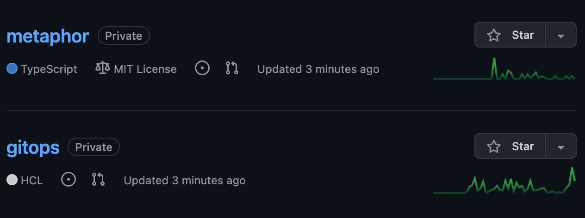
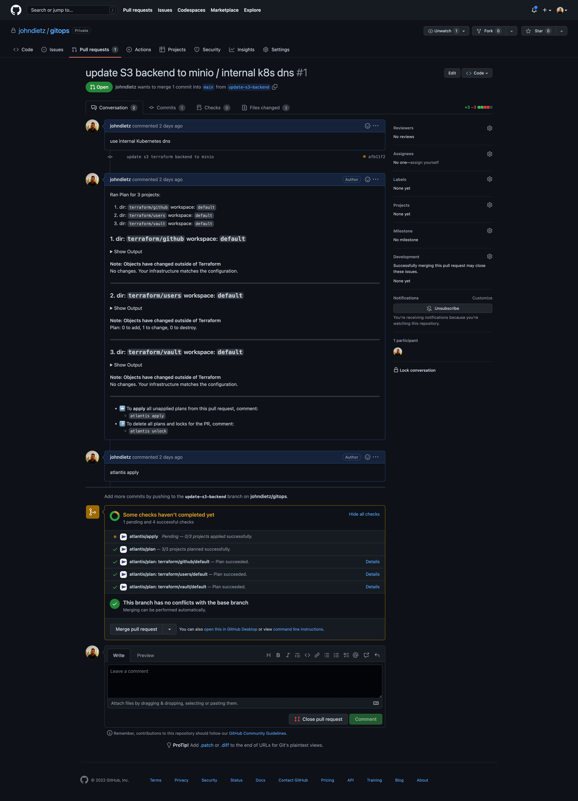

# GitHub Repositories

When you install the aws github version of kubefirst, 2 new repositories will be added to your organization's github account as shown here.



## Repository Summary

### gitops

The GitOps repo houses all of our IAC and all our GitOps configurations. All of the infrastructure that you receive with Kubefirst was produced by some combination of Terraform and ArgoCD. You can add any infrastructure or application to your platform by pull requesting it to your new `gitops` repository.

### metaphor

`metaphor` is a suite of demo microservice applications to demonstrate how an application can be integrated into the kubefirst platform following best practices. It is described in more details [here](../../../explore/metaphor.md).

## GitHub Repository Management

These GitHub repositories are being managed in Terraform.

As you need additional GitHub repositories, just add a new section of Terraform code to `terraform/github/repos.tf`:

```terraform
# set auto_init to false if importing an existing repository
# true if it's a new repository

module "your_repo_name" {
  source = "./modules/repository"
  visibility         = "private"
  repo_name          = "your-repo-name"
  archive_on_destroy = true
  auto_init          = false
}
```

GitHub's Terraform provider provides many more configuration options than just these settings. Check them out and add to your default settings once you're comfortable with the platform.

Take a look at the `Resources` section of the GitHub provider [documentation](https://registry.terraform.io/providers/integrations/github/latest/docs).

That was just GitHub. Take a look at all the Terraform providers that are available; the list of technologies you can manage in Terraform is really impressive. [](https://www.terraform.io/docs/providers/index.html)

## Making Terraform Changes

To make infrastructure and configuration changes with Terraform, simply open a pull request against any of the Terraform directory folders in the `gitops` repository. Your pull request will automatically provide plans, state locks, and applies, and even comment in the merge request itself. You'll have a simple, peer reviewable, auditable changelog of all infrastructure and configuration changes.


