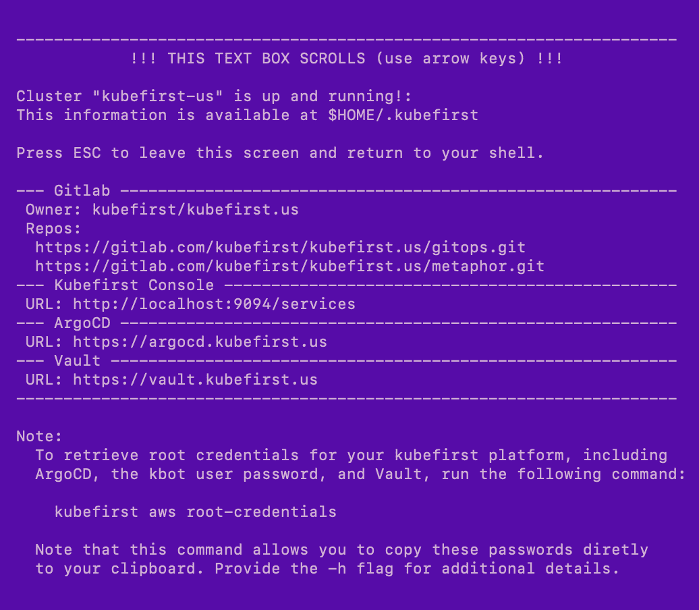

## AWS Platform Installation using GitLab

**kubefirst** is the name of our command line tool that installs the kubefirst platform and provides some platform conveniences.

It installs a fully automated platform of open source cloud native tools with a simple `init` and `create` command.


### Prerequisites

- [Install](../../../kubefirst/overview.md#install-the-kubefirst-cli) the kubefirst CLI.

#### GitLab

- Create or use an existing [GitLab account](https://gitlab.com).
- Create a [GitLab group](https://docs.gitlab.com/ee/user/group/) developer permissions.

> GitLab SaaS offering has limitations that require us to use groups contrary to GitHub which can be use without an organization.

#### AWS

1. Create an AWS account with billing enabled.
2. Establish a public hosted zone with DNS routing established([docs](https://docs.aws.amazon.com/Route53/latest/DeveloperGuide/AboutHZWorkingWith.html)).
3. Connect with [Administrator Access](https://console.aws.amazon.com/iam/home?#/policies/arn:aws:iam::aws:policy/AdministratorAccessserviceLevelSummary) IAM credentials to your AWS account ([docs](https://docs.aws.amazon.com/general/latest/gr/aws-sec-cred-types.html#access-keys-and-secret-access-keys)).
4. Our Homebrew package will automatically install the [AWS IAM Authenticator](https://docs.aws.amazon.com/eks/latest/userguide/install-aws-iam-authenticator.html) dependency. If you use another installation method, you will need to install this utility.

### Step 1 - Create your kbot user and a personal access token

The kubefirst cli will automatically create one admin user for you named `kbot`. After the installation, you will temporarily use that `kbot` account to onboard yourself and the rest your team to the platform. From that point forward, the `kbot` should only be used for automated activities, and you should use your own personal account.

The `kbot` user needs to be associated with a GitLab user account that can be used as your organization's bot account. Log out of GitLab and create a new GitLab account to represent this new `kbot` account. Because this account will be used for automation, it's a good to choose a username that generically represents your company or project name. You can also have fun with it and give your bot a fun name - the point is that this is not an account for your long term personal use, it's for the kubefirst platform system to use.

Your new `kbot` account will need to be associated with a GitLab organization.

- If you don't already have one that you want to use, while logged into GitLab with your new `kbot` account, establish a new [GitLab organization](https://docs.gitlab.com/ee/topics/set_up_organization.html).
- If you do already have a GitLab org that you want to add kubefirst to, you'll need to add your new kubefirst bot as an owner to the existing organization now.

### Step 2 - Create your platform

```shell
kubefirst aws create \
  --alerts-email yourdistro@your-company.io \
  --git-provider gitlab \
  --gitlab-group your-gitlab-group \
  --domain-name your-domain.io \
  --cluster-name kubefirst
```

## Example of terminal output following cluster creation



## Root credentials

To obtain your 3 initial passwords, run

```shell
kubefirst aws root-credentials
```


:::note the `kubefirst aws root-credentials` command was introduced in 2.0.1

## Connecting to Kubernetes

Replace `kubefirst` in the command below with your cluster's name if you specified one

```shell
aws eks update-kubeconfig --name kubefirst
```

To view all cluster pods run

```shell
kubectl get pods -A
```
