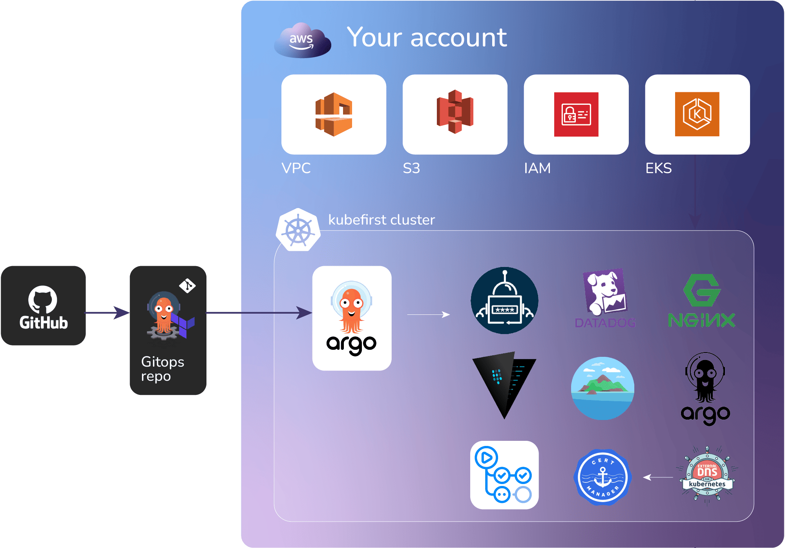
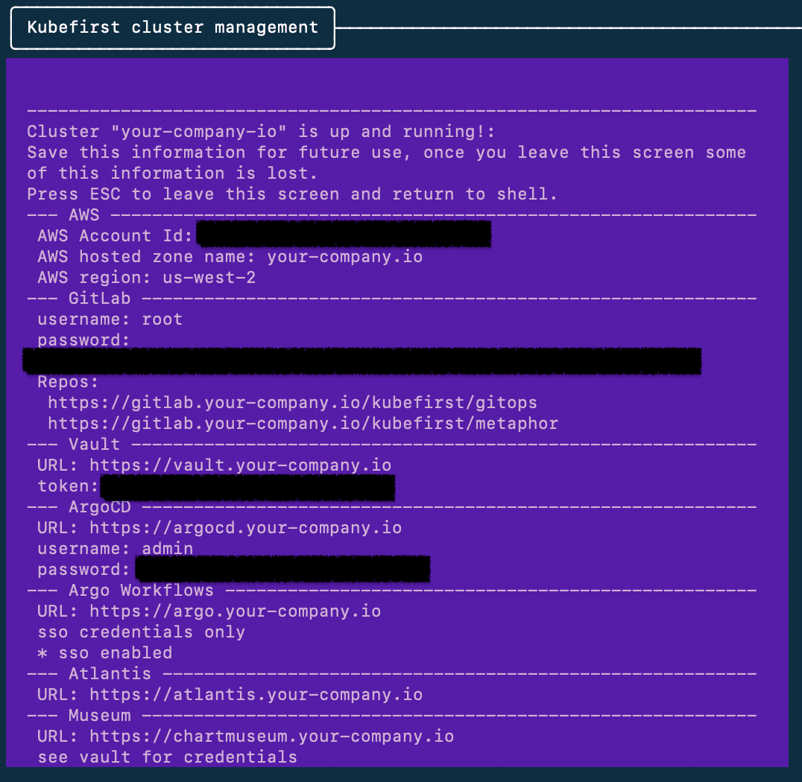

### Installed Applications

For details on the installed platform components see our [overview page](../../overview.md#platforms-details).

## Step 1: Console UI

Once you run the `kubefirst` command at the end of the installation will open a new browser tab with the Console UI at `http://localhost:9094` to provide you a dashboard to navigate through the different services that were provisioned.

These are **not your personal credentials**. These are administrator credentials that can be used if you ever need to authenticate and administer your tools if your OIDC provider ever become unavailable. Please protect these secrets and store them in a safe place.

### Step 2: Add Your Team (optional)

This step is meant to explore the onboarding process of a new user to your installation:

- [Explore Atlantis & Terraform to manage users](../../../explore/terraform.md#how-can-i-use-atlantis-to-add-a-new-user-on-my-gitlab-backed-installation)

### Step 3: Deliver Metaphor to Development, Staging, and Production

Metaphor is a suite of sample microservice applications that we use to demonstrate parts of the platform and to test CI changes. It's the other project in the kubefirst group in GitLab.

If you visit its `.gitlab-ci.yml` in the metaphor repositories root, you'll see it's sending some workflows to Argo. Those workflows are also in the `metaphor` repository in the `.argo` directory.

The metaphor pipeline will:

- publish the metaphor container to your private ECR.
- add the metaphor image to a release candidate Helm chart and publish it to ChartMuseum.
- set the metaphor desired Helm chart version in the `gitops` repository for development, then staging.
- the release stage of the pipeline will republish the chart, this time without the release candidate notation making it an officially released version, and prepare the metaphor application chart for the next release version.
- the officially released chart will be set as the desired Helm chart for production.

To watch this pipeline occur, make any change to the `main` branch of the `metaphor` repository. If you're not feeling creative, we put a file at `.argo/ci-files/trigger.txt` that you can use. Once a file in `main` is changed, navigate to metaphor's CI/CD in GitLab to see the workflows get submitted to Argo Workflows.

You can visit the metaphor development, staging, and production apps in your browser to see the versions change as your releases complete and Argo CD syncs the apps. The metaphor URLs can be found in your `gitops` and metaphor repository `README.md` files.

### Learning the Ropes

We've tried our best to surface available customizations and patterns of the kubefirst platform here on our docs site. We've also made [links available](../../../credits.md) to all of our open source tools' own sources of documentation as well.

You can [reach out to us](https://kubefirst.io/slack) if you have any issues along the way. We're also available for consultation about where you should take the platform based on your organization's needs. We know the technologies inside and out and would love to help you do the same.
