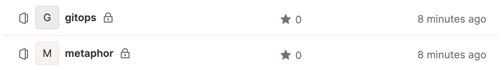

# GitLab Repositories

The `kubefirst k3d create` command will create a `gitops` and `metaphor` repository in your personal GitLab account as shown here.



## Repositories

### `gitops`

The `gitops` repository houses all of our IAC and all our GitOps configurations. All of the infrastructure and application configuration that you receive with kubefirst was produced by some combination of Terraform and Argo CD in the `gitops` repository. You will add to this repository as extend your infrastructure or new applications.

### metaphor

`metaphor` is a suite of demo microservice applications to demonstrate how an application can be integrated into the kubefirst platform following best practices. It is described in more details [here](../../../explore/metaphor.md).

## Management

As you need additional GitLab repositories, just add a new section of Terraform code to `terraform/gitlab/repos.tf` in your new `gitops` repository:

```terraform
# set auto_init to false if importing an existing repository
# true if it's a new repository

module "your_repo_name" {
  source = "./modules/repository"
  visibility         = "private"
  repo_name          = "your-repo-name"
  archive_on_destroy = true
  auto_init          = false
}
```

GitLab's Terraform provider provides [more configuration options](https://registry.terraform.io/providers/gitlabhq/gitlab/latest/docs) than just these settings.

## Making Terraform Changes

To make infrastructure and configuration changes with Terraform, simply open a merge request in the `gitops` repository. Your merge request will automatically provide plans, state locks, and applies, and even comment in the merge request itself. You'll have a simple, peer reviewable, auditable changelog of all infrastructure and configuration changes.


