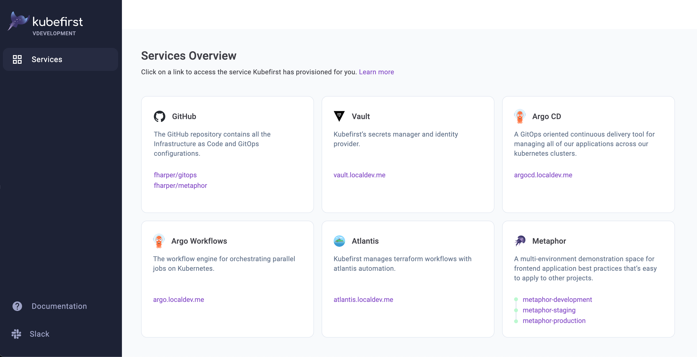
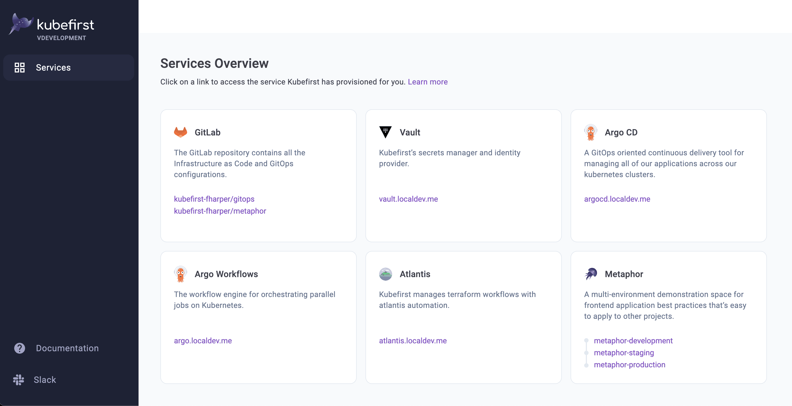

## Install the kubefirst CLI

If you are on macOS, and have [Homebrew](https://brew.sh) installed, you can run:

```shell
brew install konstructio/taps/kubefirst
```

To upgrade an existing kubefirst CLI to the latest version run:

```shell
brew update
brew upgrade kubefirst
```

There are other ways to install kubefirst for different operating systems, architectures, and containerized environments. See our [installation README](https://github.com/kubefirst/kubefirst/blob/main/build/README.md) for details.

## kubefirst in a Nutshell

The kubefirst CLI runs on your localhost and will create an GitLab or GitHub Kubernetes ecosystem including HashiCorp Vault, Argo CD, Argo Workflows, self-hosted runners for GitHub and GitLab, and the metaphor application to demonstrate how everything on the platform works.

- We have local (k3d), AWS, and Civo platforms available.
- The install takes about 30 minutes to execute on AWS, 6 minutes on Civo, and 5 minutes on local.
- kubefirst will create a new `gitops` and `metaphor` repository on your GitLab or GitHub account.
- All of the infrastructure as code (IAC) will be in your `gitops` repository in the `/terraform` directory. IAC workflows are fully automated with Terraform Atlantis by opening a merge or pull request against the `gitops` repository.
- All of the applications running in your Kubernetes cluster are registered in the `gitops` repository in the root `/registry` directory.
- The [metaphor](../explore/metaphor.md) repositories only needs an update to the main branch to deliver the example application to your new development, staging, and production environments. It will hook into your new HashiCorp Vault for secrets, demonstrate automated certs, automated DNS, and GitOps application delivery.
- Our CI/CD is powered by Argo CD, Argo Workflows, GitLab or GitHub, and HashiCorp Vault.

### Platforms Details

|                           | k3d + GitHub    | k3d + GitLab  | AWS + GitHub  | AWS + GitLab  | Civo + GitHub | Civo + GitLab |
|---------------------------|-----------------|---------------|---------------|---------------|---------------|---------------|
| Argo CD                   | X               | X             | X             | X             | X             | X             |
| Argo Workflows            | X               | X             | X             | X             | X             | X             |
| Atlantis                  | X               | X             | X             | X             | X             | X             |
| ChartMuseum               | X               | X             | X             | X             | X             | X             |
| External Secrets Operator | X               | X             | X             | X             | X             | X             |
| HashiCorp Vault           | X               | X             | X *           | X *           | X             | X             |
| kubefirst console         | X               | X             | X             | X             | X             | X             |
| metaphor                  | X               | X             | X             | X             | X             | X             |
| OpenID Connect (OIDC)     |                 |               | X             | X             | X             | X             |
| Reloader                  | X               | X             | X             | X             | X             | X             |
| Self-Hosted Runners       | ARC             | GitLab Runner | ARC           | GitLab Runner | ARC           | GitLab Runner |
| SSL Certificates          | mkcert          | mkcert        | Let's Encrypt | Let's Encrypt | Let's Encrypt | Let's Encrypt |

ARC is the [Actions Runner Controller](https://github.com/actions/actions-runner-controller), a Kubernetes controller for GitHub Actions self-hosted runners.

\* AWS with GitHub & GitLab have HashiCorp Vault backed with DynamoDB & KMS.

## kubefirst Console

Once you run `kubefirst <platform> create` command, a new browser tab will launch with the kubefirst Console app to provide you a launch page with access to the different services that were provisioned.

<!--tabs-->
# GitHub



# GitLab



<!--/tabs-->
