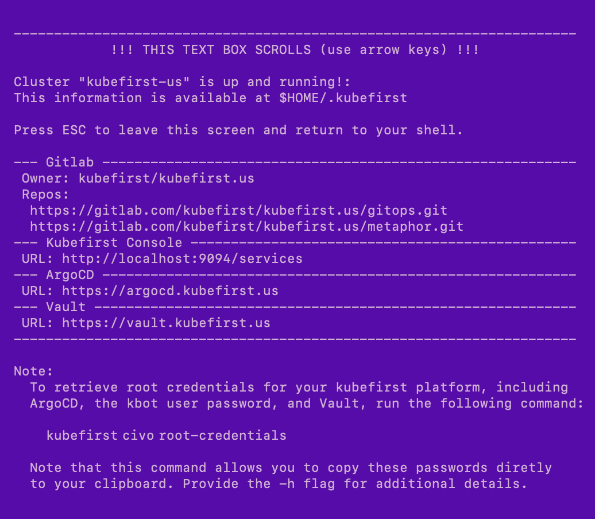

## Create your new kubefirst cluster

Adjust the following command with your GitHub and Civo tokens in addition to the appropriate values for your new platform.

```shell
export GITHUB_TOKEN=ghp_xxxxxxxxxxxxxxxx
export CIVO_TOKEN=xxxxxxxxxxxxxxxxxxxxxxxxxxxxxxxxxxxx

kubefirst civo create \
  --alerts-email yourdistro@your-company.io \
  --github-org your-github-org \
  --domain-name your-domain.io \
  --cluster-name kubefirst
```

The kubefirst CLI will produce a directory of utilities, a state file, and some staged platform content that can now be found in the `~/.kubefirst` and `~/.k1` folders on your local machine.

After the ~10 minute installation, your browser will launch a new tab to the [kubefirst Console](https://github.com/kubefirst/console), which will help you navigate your new suite of tools running in your new Civo cluster.

If your deployment is not successful, errors and troubleshooting information will be stored in a local log file specified during the installation run.


