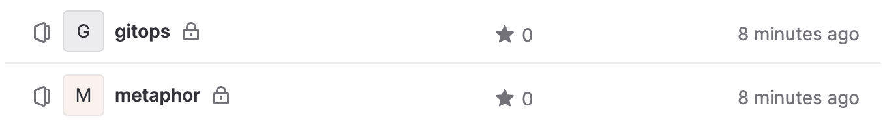
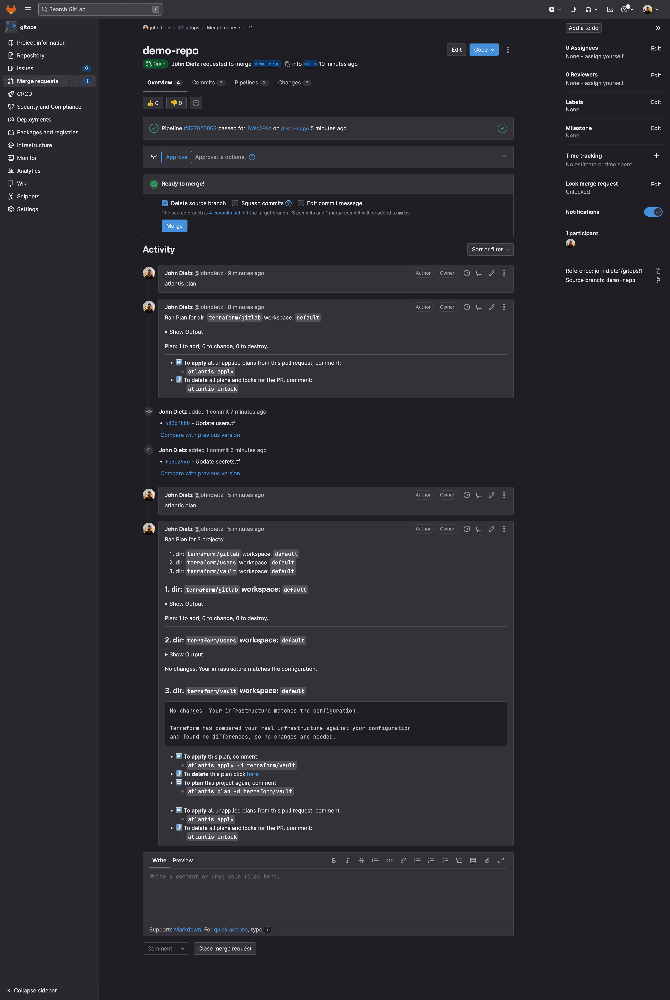

# GitLab Repositories

When you install the DigitalOcean version of kubefirst, 2 new repositories will be added to your GitLab project as shown here.



## Repository Summary

### gitops

The `gitops` repository houses all of our IAC and all our GitOps configurations. All of the infrastructure that you receive with kubefirst was produced by some combination of Terraform and Argo CD. You can add any infrastructure or application to your platform by pull requesting it to your new `gitops` repository.

### metaphor

`metaphor` is a suite of demo microservice applications to demonstrate how an application can be integrated into the kubefirst platform following best practices. It is described in more details [here](../../../common/metaphor.mdx).

## GitLab Repository Management

These GitLab projects (repositories) are being managed in Terraform. As you need additional GitLab projects, just add a new section of Terraform code to `digitalocean-gitlab/terraform/gitlab/projects.tf`:

```terraform
module "your_repo_name" {
  source       = "./modules/project"
  group_name   = data.gitlab_group.owner.id
  project_name = "your_repo_name"
  # create_ecr                            = true
  initialize_with_readme                = false
  only_allow_merge_if_pipeline_succeeds = false
  remove_source_branch_after_merge      = true
}
```

## Making Terraform Changes

To make infrastructure and configuration changes with Terraform, simply open a pull request against any of the Terraform directory folders in the `gitops` repository. Your pull request will automatically provide plans, state locks, and applies, and even comment in the merge request itself. You'll have a simple, peer reviewable, auditable changelog of all infrastructure and configuration changes.


