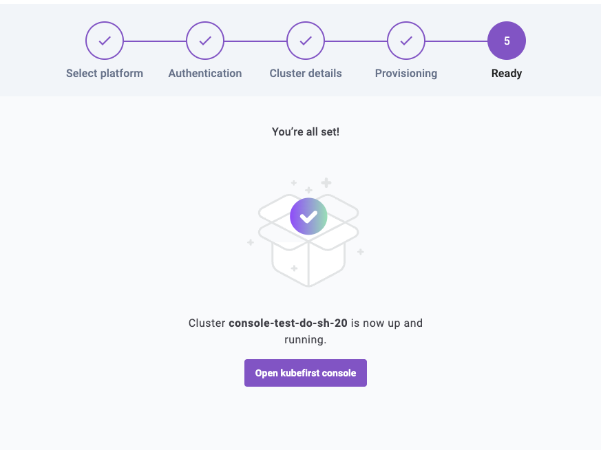
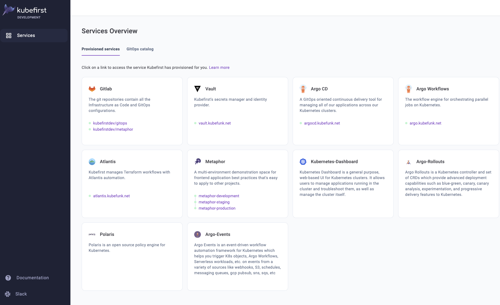

# GitOps Catalog

:::info

Please note that the gitops catalog was updated in patch 2.3.8 to support multicluster and template installations. Prior to 2.3.8, the catalog was only able to install applications to the management cluster.

:::

After your kubefirst cluster has been provisioned, you can optionally leverage the kubefirst GitOps Catalog.

The GitOps Catalog is a community driven collection of Kubernetes applications that can be deployed directly to your kubefirst cluster(s).

For more information regarding applications that are generally available, check out the GitOps Catalog [repository](https://github.com/kubefirst/gitops-catalog).

## Using the catalog

After your management cluster has been provisioned, you're able to click on a button to **open kubefirst console**:



Once this button has been clicked, you'll be sent to your new Kubefirst console. In the left margin, click on Applications.



This page shows the applications that have been provisioned to your kubefirst management cluster. Default applications will show up in this list without an uninstall button.

You can click on the **GitOps catalog** link to show the catalog:


From here, you can click **Install** on any of the available applications to deploy them to your specified cluster or cluster template. 

## How this works

When you opt to install any of the available services from the GitOps Catalog, the kubefirst API formats and commits a set of files to your `gitops` repository.

Then, Argo CD is asked to refresh the upstream registry to synchronize the newly deployed application.

Since the deployment of these applications is done directly in your `gitops` repository, you have full ownership to then customize these applications by adjusting their content within your `gitops` repository.

For example - consider the following sample deployment of Kubernetes Dashboard:

```yaml
---
apiVersion: argoproj.io/v1alpha1
kind: Application
metadata:
  name: management-kubernetes-dashboard
  namespace: argocd
spec:
  project: default
  source:
    repoURL: 'https://kubernetes.github.io/dashboard'
    targetRevision: 6.0.0
    chart: kubernetes-dashboard
  destination:
    name: management
    namespace: kubernetes-dashboard
  syncPolicy:
    automated:
      prune: true
      selfHeal: true
    syncOptions:
      - CreateNamespace=true
---
kind: ClusterRoleBinding
apiVersion: rbac.authorization.k8s.io/v1
metadata:
  name: k8s-dashboard-clusterrole
  annotations:
    argocd.argoproj.io/sync-wave: "0"
subjects:
  - kind: ServiceAccount
    name: management-kubernetes-dashboard
    namespace: kubernetes-dashboard
roleRef:
  kind: ClusterRole
  name: admin
  apiGroup: rbac.authorization.k8s.io
---
apiVersion: v1
kind: Secret
metadata:
  name: dashboard-user
  namespace: kubernetes-dashboard
  annotations:
    kubernetes.io/service-account.name: management-kubernetes-dashboard
type: kubernetes.io/service-account-token
```

If you'd like to change any of the Helm chart values, change the Helm chart version, or add any additional resources, you simply edit this file in the `main` branch and Argo CD will detect the changes from your upstream `gitops` repository and synchronize.
