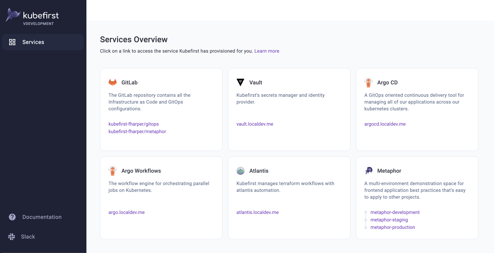
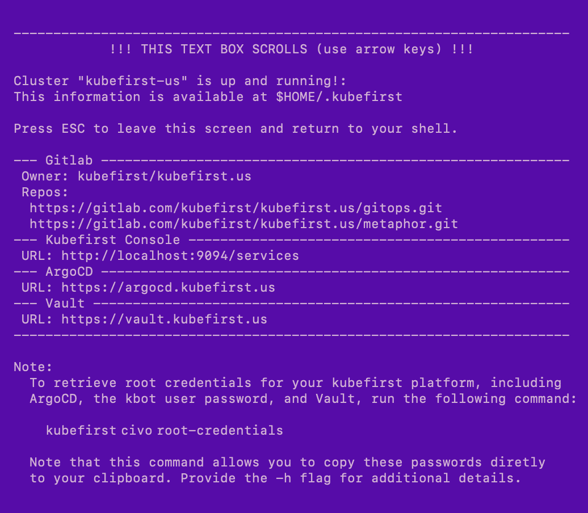
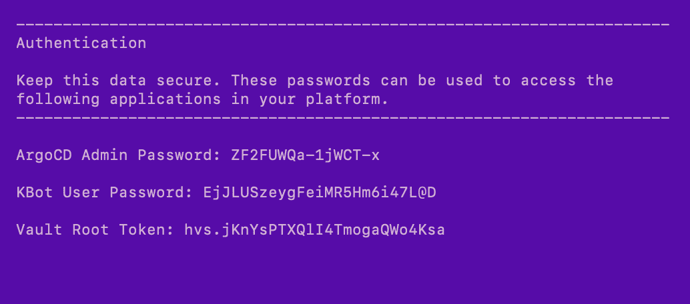

# Vultr Platform Installation

kubefirst is the name of our CLI that installs the platform of the same name to your local or cloud environment.

## Prerequisites

[Install](../../../index.mdx#install-the-kubefirst-cli) the kubefirst CLI.

### GitLab

- Create or use an existing [GitLab account](https://gitlab.com).
- Create a [GitLab group](https://docs.gitlab.com/ee/user/group/) developer permissions.

> GitLab SaaS offering has limitations that require us to use groups contrary to GitHub which can be use without an organization.

### Vultr

For kubefirst to be able to provision your Vultr cloud resources:

- A [Vultr account](https://www.vultr.com/register/) in which you are an account owner.
- A publicly routable [DNS](https://www.vultr.com/docs/introduction-to-vultr-dns/).
- A [Vultr API key](https://my.vultr.com/settings/#settingsapi).

## Create your new kubefirst cluster

Adjust the following command with your GitHub and Vultr tokens in addition to the appropriate values for your new platform.

```shell
export GITLAB_TOKEN=xxxxxxxxxxxxxxxx
export VULTR_API_KEY=xxxxxxxxxxxxxxxxxxxxxxxxxxxxxxxxxxxx

kubefirst beta vultr create \
  --alerts-email yourdistro@your-company.io \
  --git-provider gitlab \
  --gitlab-group your-gitlab-group \
  --domain-name your-domain.io \
  --cluster-name kubefirst
```

The kubefirst CLI will produce a directory of utilities, a state file, and some staged platform content that can now be found in the `~/.kubefirst` and `~/.k1` folders on your local machine.

After the ~10 minute installation, your browser will launch a new tab to the [kubefirst Console](https://github.com/kubefirst/console), which will help you navigate your new suite of tools running in your new Vultr cluster.

If your deployment is not successful, errors and troubleshooting information will be stored in a local log file specified during the installation run.

## Console UI Screen



## Example of terminal output following cluster creation



## Root credentials

To obtain your 3 initial passwords, run

```bash
kubefirst beta vultr root-credentials
```



## Connecting to Kubernetes

To connect to your new Kubernetes cluster, run

```bash
export KUBECONFIG=~/.k1/kubeconfig
```

To view all cluster pods, run

```bash
kubectl get pods -A
```

### Installed Applications

To see what is installed by kubefirst, check the [overview page](../../overview.mdx).
