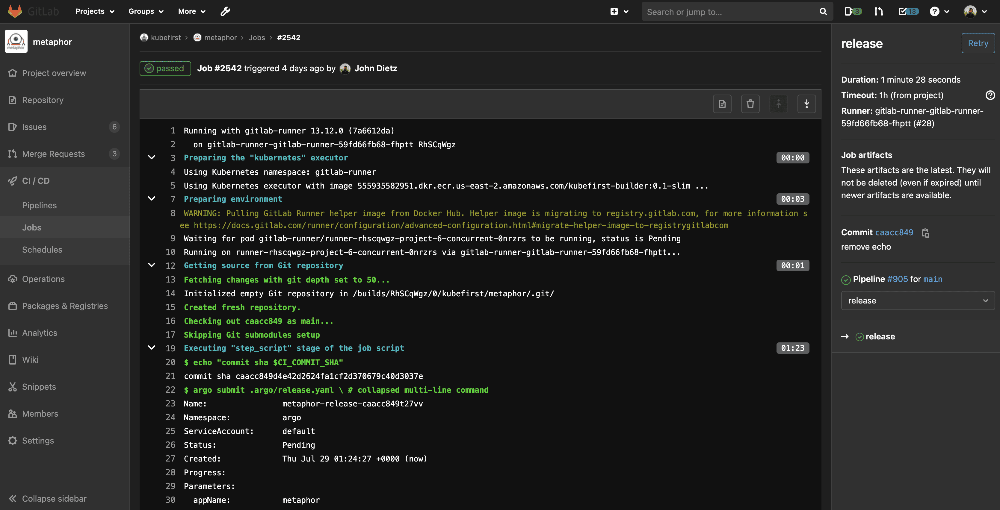
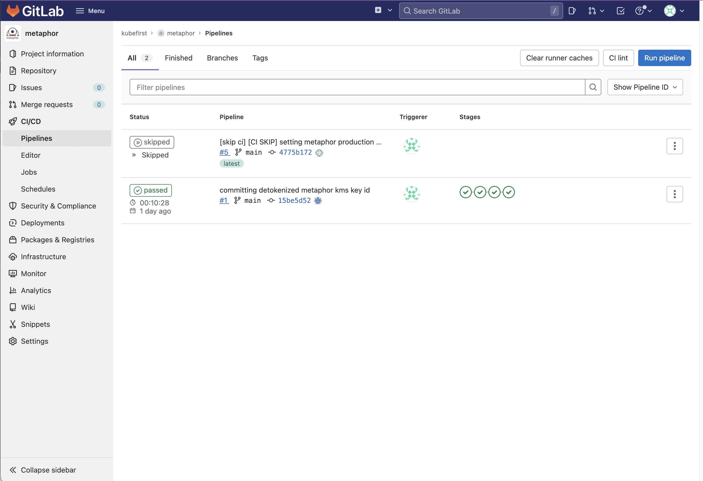

The integration that we've established between GitLab and Argo Workflows will surface your powerful Argo Workflows engine directly in GitLab's native CI, so that your developers have all of the workflow execution information available directly associated with their commit in their application repository.

