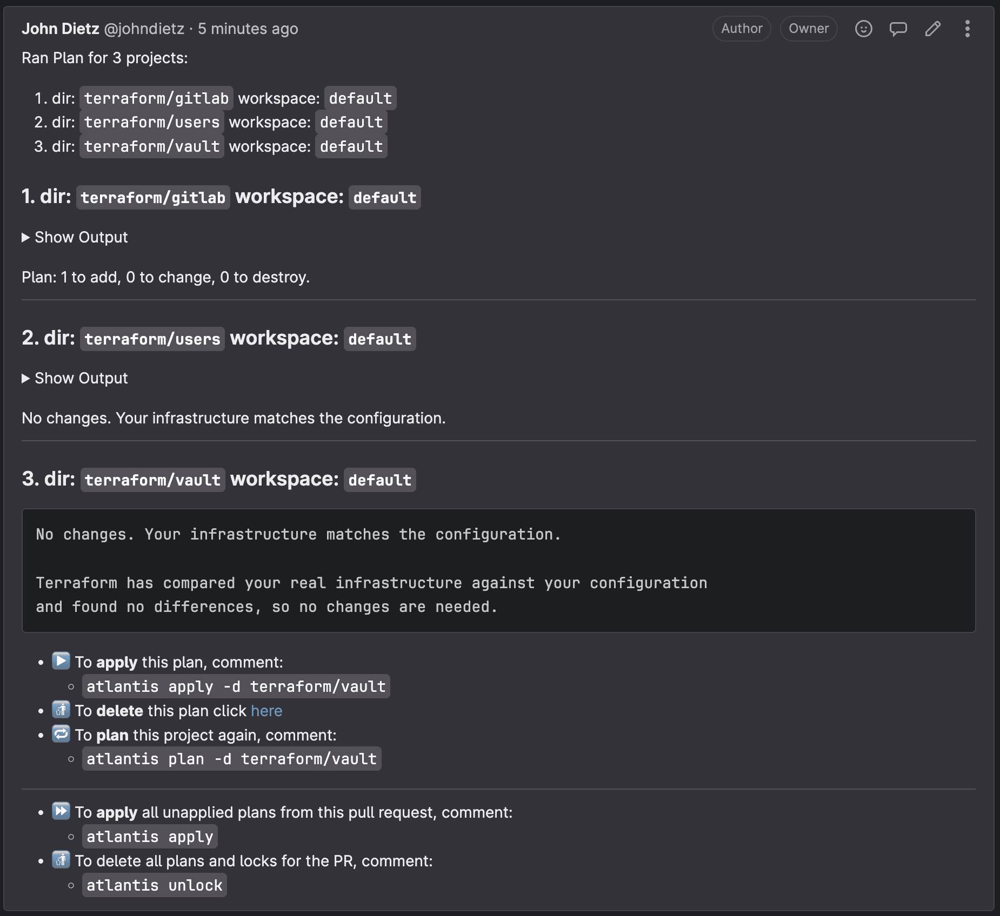
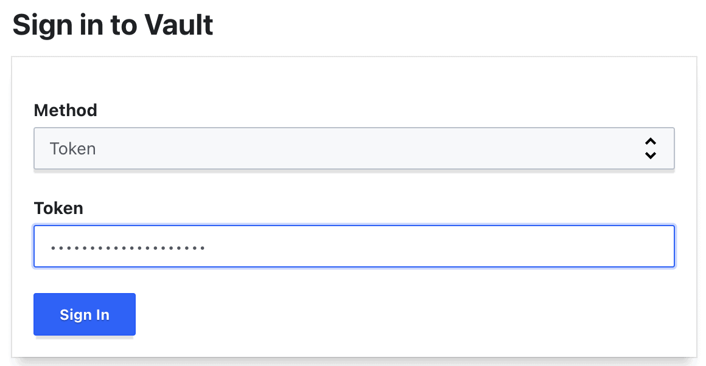
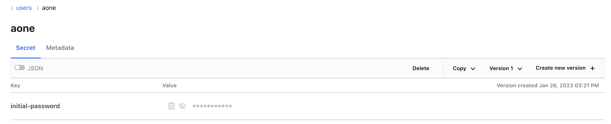

In this tutorial we will show how to add users to your platform through [Atlantis](https://www.runatlantis.io/), which will allow a preview of how changes made will be expressed through Terraform before branches are merged into your repository.

Navigate to the `gitops` repository in your GitLab group, clone the contents, and create a new branch:

```shell
cd gitops
git checkout -b new-user
```

The folder <code>{props.cloud}-gitlab/terraform/users/admins</code> contains two separate files that represent admin users: `admin-one.tf` (commented-out), and the kbot user in the `kbot.tf` file. Here's the module from `admin-one.tf`:

```terraform
module "admin_one" {
  source = "../modules/user"

  acl_policies            = ["admin"]
  email                   = "your.admin@your-company.io"
  first_name              = "Admin"
  fullname                = "Admin One"
  group_id                = data.vault_identity_group.admins.group_id
  gitlab_username         = "your-admins-gitlab-username"
  last_name               = "One"
  username                = "aone"
  user_disabled           = false
  userpass_accessor       = data.vault_auth_backend.userpass.accessor
}
```

Uncomment and edit this code to replace the values for the `email`, `first_name`, `gitlab_username`, `last_name`, and `username` before pushing to your branch.

Note: If you are doing using this walkthrough simply to test Atlantis, you do not need to update these fields to be accurate.

```shell
git add .
git commit -m feat: add new user
git push --set-upstream origin new-user
```

Create a merge request. This will kick off the Atlantis workflow. Within a minute or so of submitting the merge request, a comment will appear on the merge request that shows the Terraform plan with the changes it will be making to your infrastructure.



To apply these changes, you or someone in the organization can submit a comment on that merge request with the following comment text:

`atlantis apply`

Doing so will instruct Atlantis to apply the plan. It will report back with the results of the apply within a minute or so.

NOTE: Atlantis merges your merge request automatically once an apply is successfully executed. Don't merge Terraform merge requests yourself.

Atlantis will always run plans automatically for you when a merge request is opened that changes files mapped in `atlantis.yaml`.

Any new users you have created through this process will have their temporary initial passwords stored in your Vault cluster. You can access Vault using the root login credentials provided to you during your kubefirst installation. Only the root Vault token can access these secrets. You will find your users' initial passwords in the Vault secret store `/secrets/users/<username>`.



Once you've provided them their initial password, they can update their own password throughout the platform by updating their user password entity in Vault. Anyone can change their own password, and Admins can reset anyone's password. These rules, just like everything else on kubefirst, can be configured in your new `gitops` repository.



The admins and developers that you add through IaC will automatically propagate to all tools due to the Vault OIDC provider that's preconfigured throughout the kubefirst platform tools.
