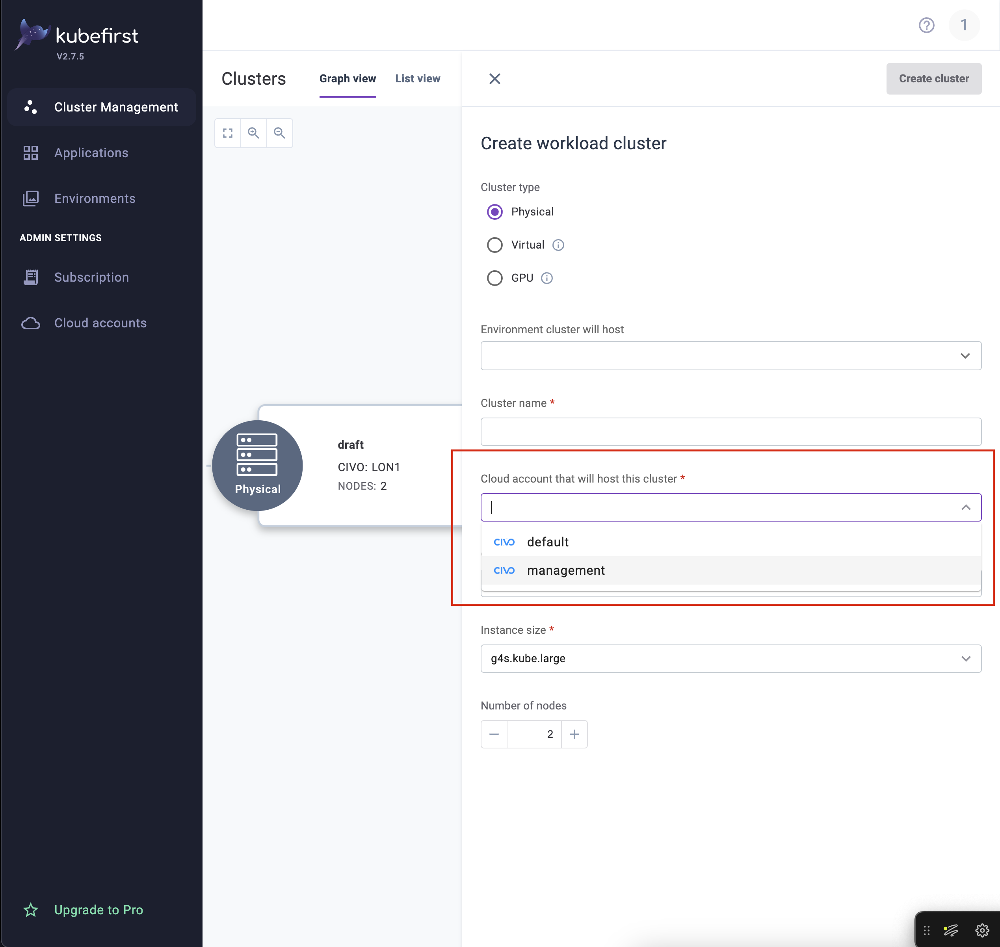

import CLUSTERS from "../../common/clusters.mdx";

<CLUSTERS />

## GPU Clusters

Kubefirst includes support for Graphical Processing Units (GPU). This capability provides Civo users who are have requirements with the capacity to run Kubefirst with performance for larger workloads.

With a GPU cluster, deployment and scalability are easily managed for AI and Machine Learning through a simple setup and Kubefirst’s seamless scaling.

- Requirements for this feature are Civo Cloud and Kubefirst. Refer to [our documentation here to install Kubefirst](./install/cli.mdx)  and you can select a GPU cluster as soon as Kubefirst is deployed.
- Take advantage of high performance infrastructure with pricing starting at $0.79 per GPU/hour, for an NVIDIA GPU (H100, H200, A100, L40S) to manage demanding AI/ML workloads, including private AI and chat-based applications.

## Multi-Account Support

Kubefirst supports multi-account functionality for Civo to deploy and manage workload clusters across multiple Civo accounts. Using multi-account you can manage and deploy workloads in multiple accounts without the need to log in and configure each account individually.

### Adding an Account

To add an additional account for Civo you will need to use the Kubefirst UI.

In the Kubefirst UI, navigate to Admin Settings and select **Cloud Accounts** and then **Add cloud account** to add a new account to Kubefirst.

This account will be available for any workload clusters you provision.

### Configure your Cluster

After adding any cloud accounts you want from Civo you can select these accounts during your cluster configuration.

Navigate to **Cluster Management** and **Create Cluster**. Select your preferred Cloud Account under the option labelled "Cloud account that will host this cluster".

