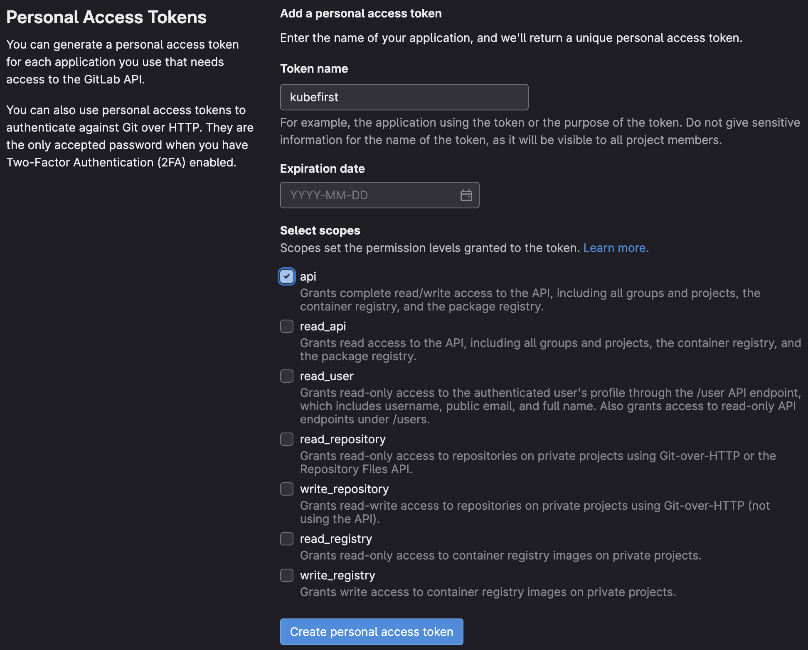

Kubefirst uses a GitLab token to authenticate with the GitLab API. Tokens can be used to perform various actions on a user's behalf, such as creating, and deleting repository files. Kubefirst uses a limited number of scopes (what is allowed with the issued token) to provision the Kubefirst platform such as creating GitLab repositories and updating GitLab repository webhook URL.

Kubefirst issue GitLab Tokens at the beginning of the installation using [GitLab device login flow](https://docs.gitlab.com/ce/api/oauth2.html).

## GitLab Token Scopes

Kubefirst uses the following scopes to provision the Kubefirst platform:

:::info
Those permissions are the minimum require scopes we need for the token as we need to be able to create two Git repositories, add an SSH key, create groups, and more. It is used at the cluster creation, but will also be used by Atlantis and Argo CD during your management, and workload clusters usage. We do not suggest removing some of the scopes once the management cluster is created.

If you feel unease with that, we suggest you create a new GitHub or GitLab user for the sake of testing Kubefirst.
:::

## How to create a GitLab Token

There are different ways to create a GitLab token. The easiest way is to start the Kubefirst installer, and follow the screen instructions. It will guide you to issue a token with the list of scope described above.

There are other ways to create a GitLab token. You can login into your GitLab account and issue a Personal Access Token following the list of scopes above. With the manually generated token, you can provide it via environment variable: `export GITLAB_TOKEN`.

:::tip
If you never connected to GitLab using SSH before, be sure to add it to the known host using the command `ssh-keyscan gitlab.com >> ~/.ssh/known_hosts` to ensure you won't get a `ssh: handshake failed: knownhosts: key is unknown` error. If you get the `known_hosts file does not exist` error when running the previous command, it's because you are missing the `~/.ssh` folder, so run `mkdir ~/.ssh` and try the `ssh-keyscan` command again.
:::
